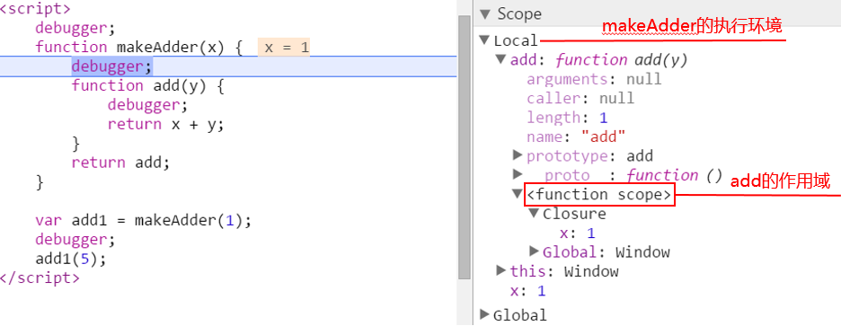

## 作用域与闭包 ##

* JS闭包的定义
* JS闭包产生条件
* JS闭包原理
* JS闭包应用

### 基本概念
- 函数作用域：它由函数被声明时所处的位置决定，与在哪儿调用无关。
- 词法环境：在代码编译阶段记录变量声明、函数声明。函数声明形参的合集。
- 作用域链：当代码要访问一个变量时，首先会搜索自身的作用域（即内部词法环境）是否有此变量，再沿着 outer，去父作用域（外部环境），然后搜索更外部的环境，以此类推，直到全局词法环境。
- 所有函数都有个[[Environment]] 的隐藏属性，该属性保存了对创建该函数的词法环境的引用
- 自由变量：指在函数中使用的，但既不是函数参数也不是函数局部变量的变量。

### 闭包的定义
各路大神对于闭包的定义：
- 候策：函数嵌套函数时，内层函数引用了外层函数作用域下的变量，并且内层函数在全局环境下可访问，就形成了闭包。
- MDN：闭包是指那些能够访问自由变量的函数，由此，我们可以看出闭包共又两部分组成，闭包 = 函数 + 函数能够访问的自由变量。
- 现代 JavaScript 教程：闭包是指一个函数可以记住其外部变量并可以访问这些变量。
```
function makeAdder(x) {
    function add(y) {
        return x + y;
    }
    return add;
}

var add1 = makeAdder(1);
add1(5); // 6
```


### 闭包产生条件
内嵌函数使用了外部函数的局部变量。  
注意：闭包的产生不需要把内嵌函数当做返回值返回。Closure说的是函数和它引用的变量之间的关系，和它返回不返回值，返回什么值没有关系。【感觉不太对？】

### 闭包原理  
JS闭包是通过作用域链实现的

### 闭包应用
作为返回值
```js
function foo() {
    var a = 1;
    return function bar() {
        console.log(a)
    }
}
var baz = foo();
baz();  // 1
```

作为参数传递
```js
function foo() {
    var a = 1;
    function bar() {
        console.log(a)
    }
    baz(bar)
}
```

私有实例变量
```js
function Person(name, age, like) {
    return {
        toString() {
            return `${name} ${age} ${like}`
        }
    }
}
const johnny = new Person('johnny', 28, 'sayhi')
console.log(johnny.toString())
```

函数式编程
```js
function add(a) {
    return function (b) {
        return a + b
    }
}
add(2)(3) // 5
```

定时器、事件监听、Ajax 请求、跨窗口通信、Web Workers 或者任何异步，只要使用了回调函数，且函数中引入了变量，那就形成了闭包。
- 定时器与闭包
```js
function wait(message) {
    setTimeout(function timer() {
        console.log(message);
    }, 1000);
}
wait( "Hello, closure!" );
```

- 事件监听与闭包
```js
function setupBot(name, selector) {
    $(selector).click(function activator() {
        console.log("Activating: " + name);
    });
}
setupBot( "Closure Bot 1", "#bot_1" );
```

- 在防抖、节流函数中使用闭包

### 循环与闭包  
正常情况下，我们对这段代码行为的预期是分别输出数字 1~5，每秒一次，每次一个。
但实际上，这段代码在运行时会以每秒一次的频率输出五次 6
```js
for (var i=1; i<=5; i++) {
    setTimeout(function timer() {
        console.log( i );
    }, i*1000);
}
```

块作用域和闭包联手，就可以按预期，分别输出数字 1~5，每秒一次，每次一个
```
for (let i=1; i<=5; i++) {
    setTimeout( function timer() {
        console.log( i );
    }, i*1000 );
}
```

### 闭包与内存泄漏
Q：js在什么时候去回收变量和函数？
Q：在什么情况下，使用闭包会存在内容泄漏问题？


参考文档：  
1. [JS闭包](http://blog.csdn.net/willspace/article/details/48315481)
2. [为什么说JS的函数都可以称为闭包？](https://segmentfault.com/q/1010000007237712?_ea=1289880)
3. [深入理解JavaScript——闭包](https://zhuanlan.zhihu.com/p/574913236)
