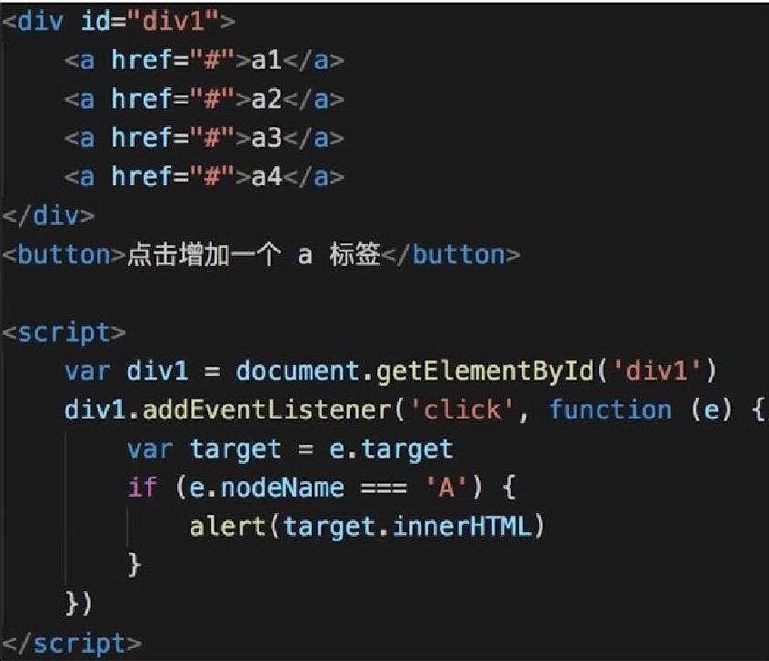
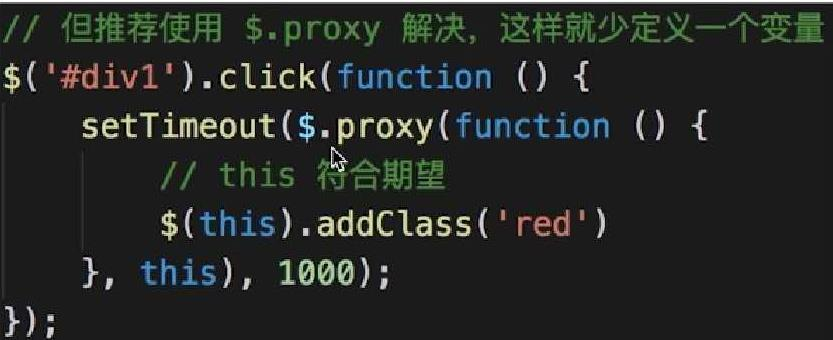
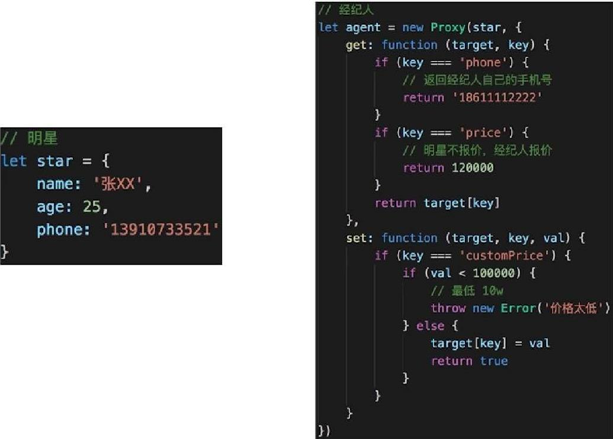

# 代理模式

## 介绍
使用者无权访问目标对象，中间加代理，通过代理做授权和控制。

## 场景
- 网页事件代理

- jQuery $.proxy

- ES6 proxy


## UML类图


## 实现
```js
class ReadImg {
  constructor(fileName){
    this.fileName = fileName;
    this.loadFormDisk();
  }
  display(){
    console.log('display...' + this.fileName)
  }
  loadFromDisk(){
    console.log('loading...' + this.fileName)
  }
}
// 代理类
class ProxyImg {
  constructor(fileName){
    this.realImg = new ReadImg(fileName)
  }
  display(){
    this.realImg.display()
  }
}
```