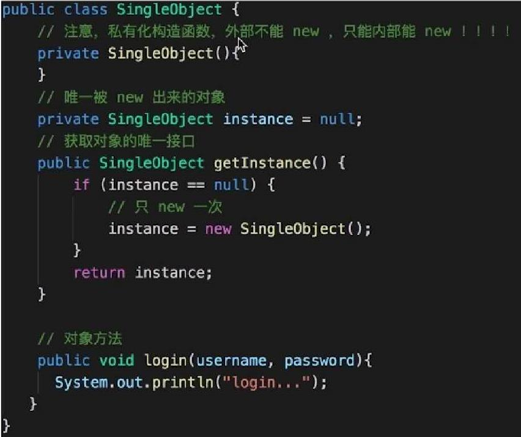
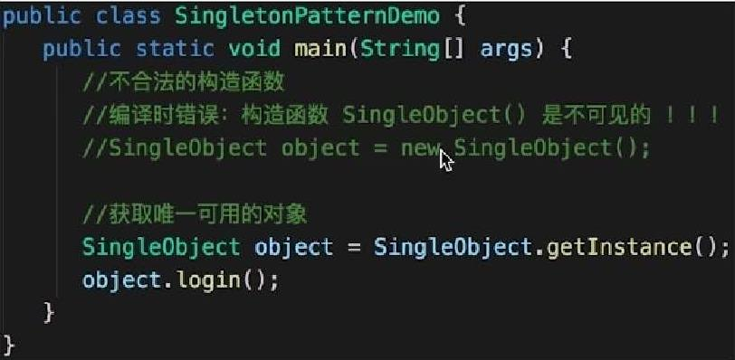

# 单例模式

## 场景
- jQuery 只有一个 $，哪怕引用了 N 次 jQuery 文件。Q：这个真的是单例模式吗？
```js
if(window.jQuery != null){
  return window.jQuery;
} else {
  // 初始化
}
```


## UML类图

## JavaScript实现
```js
// 缺点：只能靠文档去约束不能使用 new SingleObejct()，无法完全控制。
class SingleObject {
  login(){
    console.log('login....')
  }
}
// 在 js 中使用闭包实现单例模式
SingleObject.getInstance = (function() {
  let instance
  return function() {
    if(!instance){
      instance = new SingleObject()
    }
    return instance
  }
})()
let obj1 = SingleObject.getInstance();
obj1.login();
let obj2 = SingleObject.getInstance();
obj2.login();
console.log('obj1 === obj2', obj1 === obj2)
```

## Java实现


