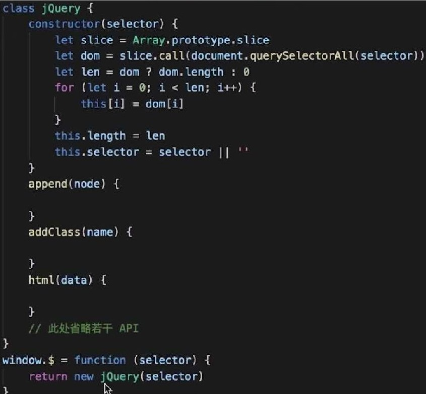
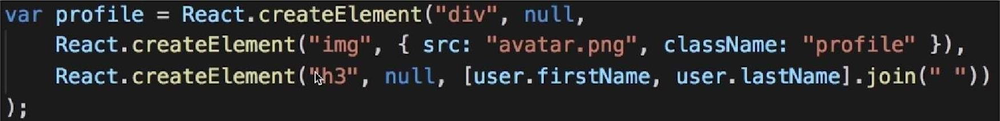
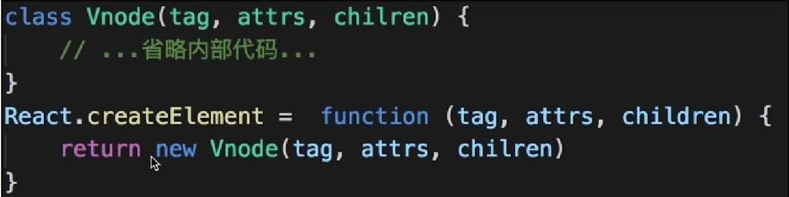
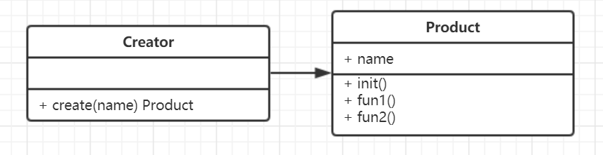

# 工厂模式
- 构造函数与创建者分离。

## 场景
- jQuery - $('div')

- React.createElement


- Vue 异步组件？

## UML类图


## 实现
```js
class Product {
  constructor(name){
    this.name = name;
  }
  init(){}
  fun1(){}
  fun2(){}
}

// Creator工厂，通过 create 函数创建 Product
class Creator {
  create(name){
    return new Product(name);
  }
}
let creator = new Creator();
let p = creator.create('p1');
```
