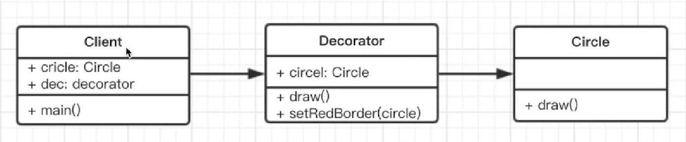

# 装饰器模式

## 介绍
为对象添加新功能，不改变原有的功能和结构。

## 场景
- ES7装饰器
- core-decorators 第三方库

## UML类图


## ES7装饰器
### 装饰类
一个简单的 Demo
```js
function testDec(target) {
  target.isDec = true
}

@testDec
class Demo {
  // ....
}
console.log(Demo.isDec)  // true
```

装饰器的原理
```js
@decorator
class A{}

// 等同于
class A {}
A = decorator(A) || A;
```

装饰类-mixin示例
```js
function mixin(...list) {
  return function(target) {
    Object.assign(target.prototype, ...list)
  }
}
let Foo = {
  foo(){ console.log( 'foo')}
}
@mixin(Foo)
class MyClass {}

let obj = new MyClass();
obj.foo();  // 'foo'
```

### 装饰方法
```js
// 只读装饰器
function readonly(target,name,descriptor) {
  descriptor.writable = false;
  return descriptor;
}

// 打印日志的装饰器
function log(target,name,descriptor) {
  var oldValue = descriptor.value;
  descriptor.value = function() {
    console.log(`Calling ${name}`, arguments)
    oldValue.apply(this, arguments)
  }
  return descriptor;
}

class Person {
  constructor(){
    this.first = 'A'
    this.last = 'B'
  }
  
  // 装饰方法
  @readonly
  name(){
    return this.first + this.last;
  }
  
  @log
  eat(){
    console.log('He is eating');
  }
}

let p = new Person();
console.log(p.name());
p.name = function() { };  // 这里会报错，因为 name 是只读的
```