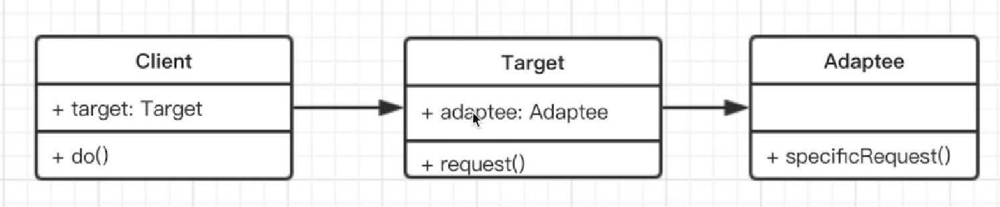

# 适配器模式

## 介绍

## 场景
- 封装旧接口
- vue computed

## UML类图


## 实现
```js
class Adaptee{
  specialRequest(){
    return '德国标准插头'
  }
}

class Target{
  constructor(){
    this.adaptee = new Adaptee();
  }
  request(){
    let info = this.adaptee.specialRequest();
    return `{info} -> 转换头 ->中国标准插头`
  }
}
let target = new Target()
target.request()

```