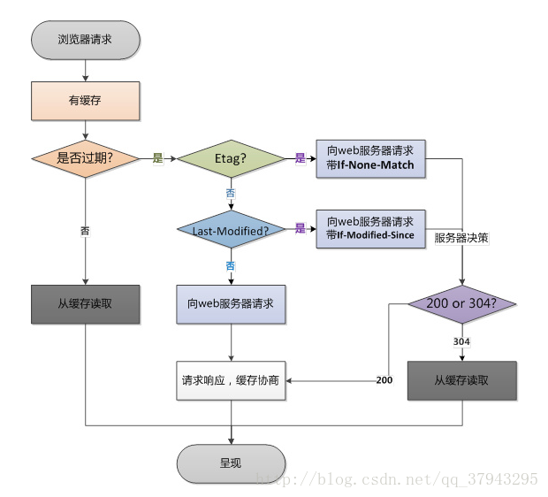

# 浏览器缓存

## HTTP缓存机制
HTTP 缓存又分为**强缓存**和**协商缓存**。优先级较高的是强缓存，在命中强缓存失败的情况下，才会走协商缓存。

### 强缓存（缓存过期策略）
客户端用来确认存储在本地的缓存数据是否过期，进而决定是否要发请求到服务端获取数据。
- expires，http1.0版有效，expires 是一个时间戳。expires 是有问题的，它最大的问题在于对“本地时间”的依赖。如果服务端和客户端的时间设置不同，或者我直接手动去把客户端的时间改掉，那么 expires 将无法达到我们的预期。
- Cache-Control，优先级高于expires
  - no-store，不使用任何缓存策略，无论是强缓存还是协商缓存都不会使用。
  - no-cache，不会去询问浏览器的缓存情况，而是直接向服务端去确认该资源是否过期，未过期则使用缓存文件。
  - max-age=31536000，max-age 不是一个时间戳，而是一个时间长度。缓存未过期，则直接使用浏览器缓存。
  - s-maxage=31536000，s-maxage仅在代理服务器中生效，客户端中我们只考虑max-age。
  - public 与 private，是否能够被代理服务缓存。如果我们设置了 private，则该资源只能被浏览器缓存。

### 协商缓存（缓存对比策略）
- Last-Modified（If-Modified-Since），Last-Modified 是一个时间戳，使用 Last-Modified 存在一些弊端：
  - 我们编辑了文件，但文件的内容没有改变。服务端并不清楚我们是否真正改变了文件，它仍然通过最后编辑时间进行判断。
  - 当我们修改文件的速度过快时（比如花了 100ms 完成了改动），由于 If-Modified-Since 只能检查到以秒为最小计量单位的时间差，所以它是感知不到这个改动的。
- Etag（If-None-Match），优先级高于 Last-Modified。Etag 是由服务器为每个资源生成的唯一的标识字符串，这个标识字符串是基于文件内容编码的，只要文件内容不同，它们对应的 Etag 就是不同的。Etag 的生成过程需要服务器额外付出开销，会影响服务端的性能，这是它的弊端。因此启用 Etag 需要我们审时度势。正如我们刚刚所提到的——Etag 并不能替代 Last-Modified，它只能作为 Last-Modified 的补充和强化存在。

## 分级缓存策略
- 200(from cache)，这一层由缓存过期策略控制（即expires/cache-control），如果没有过期，则使用本地缓存。
- 304，这一层由缓存对比策略控制（即Etag/Last-modified），如果文件没有修改过，则返回304。
- 200，当浏览器本地没有缓存，或者缓存过期，或者用户点击了 Ctrl + F5时，服务器会返回文件数据给浏览器。

缓存流程图

## 参考文档
- [HTTP基于缓存策略三要素分解法](http://caibaojian.com/http-cache-3.html)
