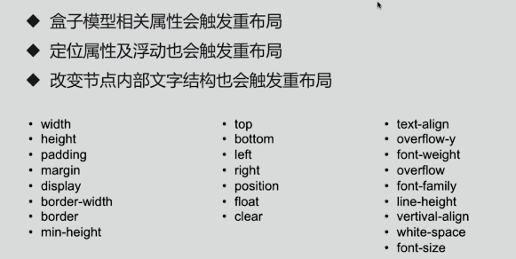

# 回流和重绘

- css性能会让js变慢吗？频繁触发重绘和回流，会导致UI频繁渲染，最终导致js变慢。
- 回流必将引起重绘，而重绘不一定会引起回流。

## 回流
当render tree中的一部分（或全部），因为元素的规模尺寸、布局、隐藏等改变而需要重新构建，这就称为回流(reflow)  

- 触发回流的CSS属性，如下图所示：

## 重绘
当render tree中的一些元素需要更新属性，而这些属性只是影响元素的外观、风格，而不会影响布局，比如background-color，这就称为重绘(repaint)  

- 触发重绘的CSS属性，如下图所示：

## 浏览器对重绘和回流的优化
现代浏览器会对频繁的回流或重绘操作进行优化：  
浏览器会维护一个队列，把所有引起回流和重绘的操作放入队列中，如果队列中的任务数量或者时间间隔达到一个阈值的，浏览器就会将队列清空，进行一次批处理，这样可以把多次回流和重绘变成一次。  
当你访问以下属性或方法时，浏览器会立刻清空队列：
- clientWidth、clientHeight、clientTop、clientLeft
- offsetWidth、offsetHeight、offsetTop、offsetLeft
- scrollWidth、scrollHeight、scrollTop、scrollLeft
- width、height
- getComputedStyle()
- getBoundingClientRect()
因为队列中可能会有影响到这些属性或方法返回值的操作，即使你希望获取的信息与队列中操作引发的改变无关，浏览器也会强行清空队列，确保你拿到的值是最精确的。

## 如何创建图层？
- 3D或透视变换CSS属性（persepective, transform）
- 使用加速视频解码的<video>节点
- 拥有3D（WebGL）上下文或者加速的2D上下文的<canvas>节点
- 混合插件（如Flash）
- 对自己的opacity做CSS动画，或者使用一个动画webkit变换的元素
- 拥有加速CSS过滤器的元素
- 元素有一个包含复合层的后代节点（子元素是独立图层）
- 元素有一个z-index较低且包含一个复合层的兄弟元素

## 优化点
### css
- 用translate替代top
- 用opacity替代visibility
- 避免使用table布局，可能很小的一个改动会造成整个table的重新布局
- 动画实现的速度的选择
- 对具有复杂动画的元素使用绝对定位，使它脱离文档流，否则会引起父元素及后续元素频繁回流。
- 必要时可以开启 GPU 加速，但是不能滥用

### javascript
- 避免逐条改变样式，使用类名去合并样式。
- 避免频繁操作DOM，创建一个documentFragment，在它上面完成所有DOM操作，最后再把它添加到文档中
- 也可以先给元素设置display: none，操作结束后再把它显示出来。因为在display属性为none的元素上进行的DOM操作不会引发回流和重绘。
- 避免频繁读取会引发回流/重绘的属性，如果确实需要多次使用，就用一个变量缓存起来。

## 参考文档
- [【笔记】web 的回流与重绘及优化](https://www.cnblogs.com/stitchgogo/p/7920828.html)
- [浏览器的回流与重绘 (Reflow & Repaint)](https://juejin.im/post/5a9923e9518825558251c96a)
- [你真的了解回流和重绘吗](https://blog.csdn.net/vM199zkg3Y7150u5/article/details/85042996)
