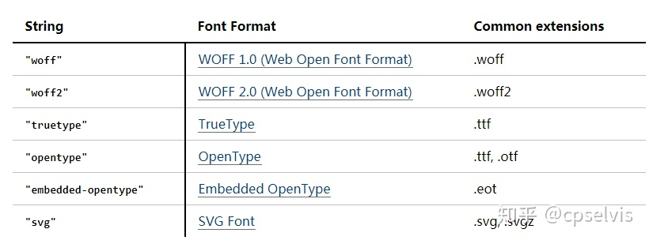

# CSS @font-face性能优化，字体加载优化的常用策略

## font-face基本用法
font-face的基本用法想必大家都是知道的，基本上就是类似这样：
```css
@font-face {
    font-family: Lato;
    src: url('font-lato/lato-regular-webfont.woff2') format('woff2'),
         url('font-lato/lato-regular-webfont.woff') format('woff'),
         url(font-lato/lato-regular-webfont.ttf) format("opentype");
}
p { font-family: Lato, serif; }
```
这样就可以使我们的网页用上自定义字体了。 除了font-family 和 src属性之外，还拥有font-style以及font-weight属性。 src可以指定多种字体，会按顺序依次适用，比如上面的示例中会先加载woff2字体，如果失败再加载woff字体，否则加载opentype字体。 src所支持的字体可以有以下类型：


src参数带不带引号都可以，参数的格式不同含义也不尽相同，比如下面：
```
src: url(fonts/simple.woff);       /* 加载simple.woff，地址相对于样式表的地址 */
src: url(/fonts/simple.woff);      /* 加载simple.woff，地址是网站的绝对地址 */
src: url(fonts/coll.otc#foo);      /* 从coll.otc字符集中加载foo字体 */
src: url(fonts/coll.woff2#foo);    /* 从coll.woff2字符集中加载foo字体 */
src: url(fonts.svg#simple);        /* 加载id 为'simple'的SVG字体 */
```
src中加载的字体地址受跨域的约束，如果想跨域加载字体，需要设置CORS。  

这就是font-face的最基础的用法。 接下来我们会进一步分析font-face的用法，并尽可能的找出优化策略。

## 什么时候会下载字体？
上面讲了字体的基本知识，那你有没有想过，字体是在什么时候下载的呢？当我们仅仅在CSS中定义如下样式的时候, 页面加载，字体会自动下载吗？
```css
@font-face {
    font-family: Lato;
    src: url('font-lato/lato-regular-webfont.woff2') format('woff2'),
         url('font-lato/lato-regular-webfont.woff') format('woff'),
         url(font-lato/lato-regular-webfont.ttf) format("opentype");
}
```
很遗憾，字体并不会下载。 通常情况下，只有当我们的页面元素用到了font-face中定义的字体的情况下，才会下载对应的字体。  

注意: 这里我们说了是通常情况，这是因为，IE8在只要是定义了font-face，即使页面元素没有使用对应的字体，也会下载。
在其它浏览器中也不尽相同，

比如在Firefox 和 IE 9+ 中，遇到如下情况也会下载字体：

html
```html
<div id="test"></div>
```
css
```css
#test {
    font-family: Lato;
}
```
有什么特别之处呢？ 你可能注意到了，这个元素虽然使用到了font-family: Lato样式，但是这个元素并没有任何文本啊！！！。 按照我们的理想情况，应该是，只有有文字内容才会去下载字体嘛。 而这就是Chrome, Safari (WebKit/Blink 等)浏览器的行为。

Chrome, Safari (WebKit/Blink 等)浏览器只有在如下类似情况才会去下载字体：

html
```html
<div id="test">这里是有文本的哦</div>
```
css
```css
#test {
    font-family: Lato;
}
```
所以总结一下，不同浏览器下载字体的策略：
- IE8 只要定义了font-face，就会去下载字体，不论实际有没有应用该字体。
- Firefox, IE 9+ 只有定义了font-face 并且页面有元素应用了该字体，就会去下载，不论该元素是否有文本内容。
- Chrome, Safari 只有定义了font-face 并且页面有元素应用了该字体，并且该元素有文本内容，才会去下载字体。
那你可能会问了，如果我们的DOM元素是通过动态插入的呢？比如：
```javascript
var el = document.createElement('div');
el.style.fontFamily = 'open_sansregular';
document.body.appendChild(el);
el.innerHTML = 'Content.';
```
答案是一样的，它的下载策略如下：
```javascript
var el = document.createElement('div');
el.style.fontFamily = 'open_sansregular';
/* 到这里，IE8就会开始下载字体 */
document.body.appendChild(el);
/* 只有到这里，Firefox, IE 9+ 才会开始下载字体 */
el.innerHTML = 'Content.';
/* 只有到这里，Chrome, Safari 才会开始下载字体 */
```

## FOIT(Flash of Invisible Text)
FOIT是浏览器在加载字体的时候的默认表现形式，也就是在自定义字体还未下载之前会先隐藏文本。大部分浏览器会隐藏文本长达3s直到字体加载完成。其他浏览器，比如Safari会等待更长的时间。有些甚至永远都不会显示文本。FOIT会导致很差的用户体验，这是我们需要尽量去避免。

## FOUT(Flash of Unstyled Text) 与 font-display属性
FOUT意思是在字体加载过程中使用默认的系统字体，字体加载完后显示加载的字体，如果超过了FOIT(3s)字体还没加载，则继续使用默认的系统字体。

IE浏览器和Edge不会等待FOIT超时才显示默认字体，会立即显示默认字体。FOUT比FOIT好，但是需要注意它引起的reflow.

那么要想使浏览器有FOUT行为，我们需要在设置@font-face的时候给它加一个属性：font-display。 font-display默认是auto, 可选属性与含义如下：
- auto. 默认值，也就是使用自定义字体的文本会先被隐藏，直到字体加载结束才会显示。
- block. Gives the font face a short block period (3s is recommended in most cases) and an infinite swap period.
- swap. 后备文本立即显示直到自定义字体加载完成后再使用自定义字体渲染文本。
- fallback. 需要使用自定义字体渲染的文本会在较短的时间（100ms according to Google ）不可见，如果自定义字体还没有加载结束，那么就先加载无样式的文本。一旦自定义字体加载结束，那么文本就会被正确赋予样式。
- optional. 效果和fallback几乎一样，都是先在极短的时间内文本不可见，然后再加载无样式的文本。不过optional选项可以让浏览器自由决定是否使用自定义字体。
一般设置成fallback和optional即可。

## preload
在页面加入下面这个代码以便更快的加载字体：
```html
<link rel="preload" href="font.woff2" as="font" type="font/woff2" crossorigin>
```
通常和最基本的字体用法配合使用

## 字体转 BASE64URI
这种方法就是将@font-face中定义字体时的路径直接改为字体的base64编码。
- 优点：这种做法的优点是不会产生FOIT和FOUT。所以也不会有reflow和repaint. 
- 缺点：字体转成base64也会很大，会影响页面首次加载速度。不支持逗号分隔的形式加载多种格式的字体，只能加载一种格式字体。这导致你为了尽可能保证所有浏览器都可以兼容，通常会指定为woff格式，因为woff格式兼容性好，但是却没法使用更小体积的woff2格式，因为woff2格式兼容性差点。

## 异步加载BASE64格式URI字体
这种方法就是通过异步的方式插入带有BASE64格式URI字体的CSS链接。

## 使用Font Load API + FOUT + class切换
这种方式是期初并不使用用到@font-face的class，然后用Font Load API加载我们想用的字体，然后切换相应的CSS即可。Font Load API是原生的API：
```javascript
document.fonts.load('1em open_sansregular')
.then(function() {
    var docEl = document.documentElement;
    docEl.className += ' open-sans-loaded';
});
```
```css
.open-sans-loaded h1 {
    font-family: open_sansregular;
}
```
当然这种方法需要考虑浏览器兼容性的问题。

## FOFT(Flash of Faux Text)
FOFT会把字体的加载分成多个部分，首先加载罗马网络字体，然后会在加载真实的粗体和斜体的时候立即使用font-synthesis属性渲染粗体和斜体的变体。

这种方法是基于[使用Font Load API + FOUT + class切换]这种方式的，非常适合加载同一种字体但是不同粗细，字形的场景，比如罗马、粗体、斜体、粗斜体等。我们将这些字体分成2阶段： 第一阶段是罗马字体，然后立即渲染人造粗体和斜体，最后(第二阶段)用真实字体替代。这里面还可以使用sessionStorage优化访问重复视图的场景。

## CRITICAL FOFT
CRITICAL FOFT和标准的FOFI的唯一区别就在于第一阶段罗马字体的加载，CRITICAL FOFT不会加载罗马字体的全集，只会加载它的一个子集（比如A-Za-z0-9），全集会在第二阶段加载。

## CRITICAL FOFT WITH DATA URI
这个和CRITICAL FOFT的唯一区别就是罗马子集字体的加载方式，前面是用Font Load API完成了，这里会将马子集字体硬编码成BASE64 URI的形式加载。

## CRITICAL FOFT WITH PRELOAD
这个同上面的唯一区别还是第一阶段罗马子集字体的加载方式，它采用的是preload的形式加载。

## 参考文献
- [CSS @font-face性能优化](https://zhuanlan.zhihu.com/p/67616144)
