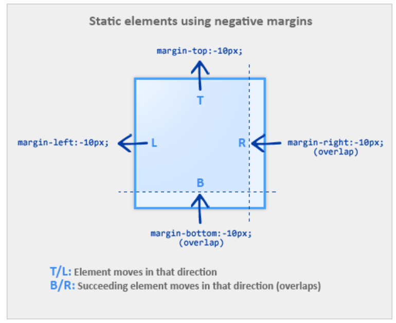

# 负边距的应用

## 负边距的表现
主要关注点有 3 个：
1. 元素本身是否会移动。
2. 后继元素是否会移动。
3. 元素和后继元素的层叠关系。  

具体情况：
- 元素在普通文档流中
  - 当 margin-top/left 为负值时，元素会朝相应方向移动。后继元素也会同步移动。
  - 当 margin-bottom/right 为负值时，元素本身不会移动。后继元素会往该元素的方向移动相应的距离，两者的层叠关系，需要看它们的 position 和 z-index 设置。
- 元素脱离了文档流，position 设置为 absolute
  - 当 margin-top/left 为负值时，元素会朝相应方向移动。对后面的元素并没有影响。
  - 当 margin-bottom/right 为负值时，元素本身不会移动。对后面的元素并没有影响。
- 元素设置了 float
- 如果元素没有设定宽度 width，那么 left 和 right 方向的负边距会朝相应方向增加元素的宽度。

## 负边距的应用
- 圣杯布局
- [固定宽高的元素，水平垂直居中](http://www.topcss.org/demo/vertical-horizontal-centering.html)
- [移除列表右侧多余的间隔、移除底部多余的 border](http://topcss.org/demo/remove-last-li-border-bottom.html)
- tab切换中的应用
- 多列未知等高布局

## 参考文档
- [负值之美：负值在页面布局中的应用](http://www.topcss.org/%E8%B4%9F%E5%80%BC%E4%B9%8B%E7%BE%8E%EF%BC%9A%E8%B4%9F%E5%80%BC%E5%9C%A8%E9%A1%B5%E9%9D%A2%E5%B8%83%E5%B1%80%E4%B8%AD%E7%9A%84%E5%BA%94%E7%94%A8/)
- [margin负值的应用](https://blog.csdn.net/qq_42372534/article/details/103630885)
