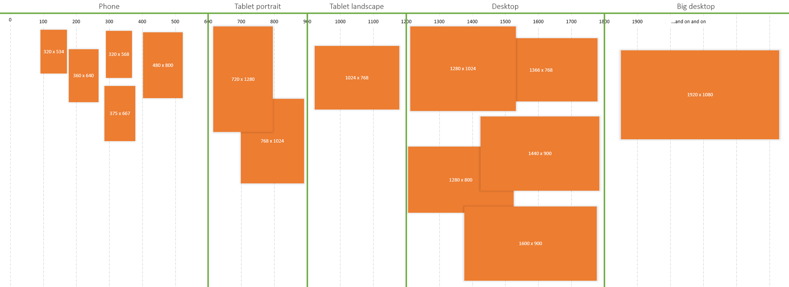
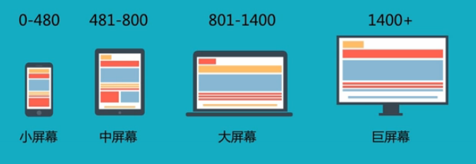
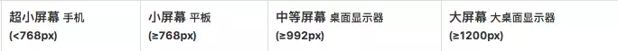

# 响应式布局原理与方案

## 移动端屏幕适配
常用设计稿尺寸：750px * 1334px

## 1.媒体查询
### 如何选择屏幕大小分割点
如果我们选择600px,900px,1200px,1800px作为分割点，可以适配到常见的14个机型：

当然这只是其中的一种分割方案，我们还可以这样划分：480px,800px,1400px,1400px

而作为曾经典型的响应式布局框架，Bootstrap是怎么进行断点的呢？

上面的分割方案不一定满足项目中的实际需求，我们可以先用跨度大的分割点进行分割，如果出现不适配的情况可以再根据实际情况增加新的分割点。

### 移动优先 OR PC优先
不管是移动优先还是PC优先，都是依据当随着屏幕宽度增大或减小的时候，后面的样式会覆盖前面的样式。因此，移动端优先首先使用的是min-width，PC端优先使用的max-width。
#### 移动优先:
```css
/* iphone6 7 8 */
body {
    background-color: yellow;
}
/* iphone 5 */
@media screen and (max-width: 320px) {
    body {
      background-color: red;
    }
}
/* iphoneX */
@media screen and (min-width: 375px) and (-webkit-device-pixel-ratio: 3) {
    body {
      background-color: #0FF000;
    }
}
/* iphone6 7 8 plus */
@media screen and (min-width: 414px) {
    body {
      background-color: blue;
    }
}
/* ipad */
@media screen and (min-width: 768px) {
    body {
      background-color: green;
    }
}
/* ipad pro */
@media screen and (min-width: 1024px) {
    body {
      background-color: #FF00FF;
    }
}
/* pc */
@media screen and (min-width: 1100px) {
    body {
      background-color: black;
    }
}
```
PC优先：
```css
/* pc width > 1024px */
    body {
        background-color: yellow;
    }
/* ipad pro */
@media screen and (max-width: 1024px) {
    body {
        background-color: #FF00FF;
    }
}
/* ipad */
@media screen and (max-width: 768px) {
    body {
        background-color: green;
    }
}
/* iphone6 7 8 plus */
@media screen and (max-width: 414px) {
    body {
        background-color: blue;
    }
}
/* iphoneX */
@media screen and (max-width: 375px) and (-webkit-device-pixel-ratio: 3) {
    body {
        background-color: #0FF000;
    }
}
/* iphone6 7 8 */
@media screen and (max-width: 375px) and (-webkit-device-pixel-ratio: 2) {
    body {
        background-color: #0FF000;
    }
}
/* iphone5 */
@media screen and (max-width: 320px) {
    body {
        background-color: #0FF000;
    }
}
```

## 2.百分比布局

## 3.rem布局

## 4.vw布局

## 5.响应式图片

## 6.1px边框
[再谈Retina下1px的解决方案](https://www.w3cplus.com/css/fix-1px-for-retina.html)

## 7.flex布局

## 参考文档
- [前端响应式布局原理与方案（详细版）](https://juejin.im/post/5caaa230e51d452b672f9703)
- [PC端自适应布局](http://blog.csdn.net/sunshine940326/article/details/55194861)
- [实用技巧！如何自适应不同的分辨率界面？](http://www.uisdc.com/adaptive-resolution-interface-how#)
- [从网易与淘宝的font-size思考前端设计稿与工作流](http://www.cnblogs.com/lyzg/p/4877277.html)
- [rem自适应布局-移动端自适应必备:flexible.js](http://caibaojian.com/flexible-js.html)
- [使用Flexible实现手淘H5页面的终端适配](https://www.w3cplus.com/mobile/lib-flexible-for-html5-layout.html)
- [再聊移动端页面的适配](https://www.w3cplus.com/css/vw-for-layout.html)
- [如何在Vue项目中使用vw实现移动端适配](https://www.w3cplus.com/mobile/vw-layout-in-vue.html)
