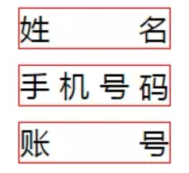

# 文字两端对齐

```html
<ul>
  <li>姓名</li>
  <li>手机号码</li>
  <li>账号</li>
</ul>
```

## text-align
- text-align:justify 不处理强制打断的行，也不处理块内的最后一行。通俗一点讲，就是只有一行显示的时候这个属性是不起作用的，或者使用了word-break: break-all;这种强制换行的属性，也是不起作用的。
- 如果内容是多于一行的时候，除了最后一行，都是两端对齐的效果。

### 使用:after伪元素
```css
ul li{
  width: 120px;
  height: 40px;
  line-height: 40px;
  text-align: justify;
  list-style: none;
}
ul li:after{
  content: '';
  display: inline-block;
  width: 100%;
}
```

## text-align-last，这个属性的兼容性不好
```css
ul li{
  width: 120px;
  text-align: justify;
  text-align-last:justify
}
```

## 参考文档
- [使用text-align:justify，让内容两端对齐，兼容IE及主流浏览器的方法](https://blog.csdn.net/qq_29608143/article/details/83625318)

