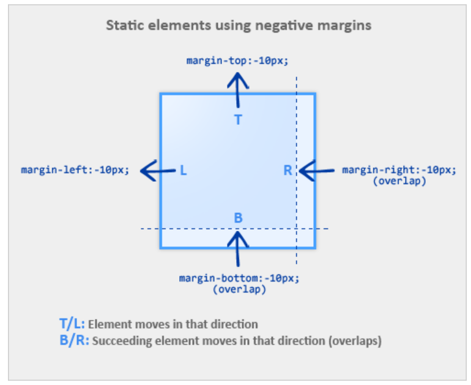

# 负边距的应用

## 负边距的表现
- top 和 left 方向的负边距会导致元素朝相应方向移动。
- bottom 和 right 方向的负边距不会导致元素移动，相反的，元素 bottom 和 right 方向的后继元素会移动进行覆盖。
- 如果元素没有设定宽度 width，那么 left 和 right 方向的负边距会朝相应方向增加元素的宽度。

## 负边距的应用
- 可用于将[固定宽高的元素，水平垂直居中](http://www.topcss.org/demo/vertical-horizontal-centering.html)
- [减少后台的判断，少写一个.last或者first的css。移除列表右侧多余的间隔、移除底部多余的border](http://topcss.org/demo/remove-last-li-border-bottom.html)
- tab切换中的应用
- 布局中应用，右侧固定右侧自适应，左右固定中间自适应
- 多列等高的应用

### 负边距与布局

## 参考文档
- [负值之美：负值在页面布局中的应用](http://www.topcss.org/%E8%B4%9F%E5%80%BC%E4%B9%8B%E7%BE%8E%EF%BC%9A%E8%B4%9F%E5%80%BC%E5%9C%A8%E9%A1%B5%E9%9D%A2%E5%B8%83%E5%B1%80%E4%B8%AD%E7%9A%84%E5%BA%94%E7%94%A8/)
