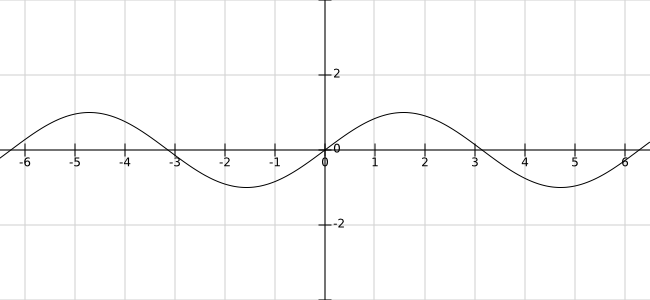

# Canvas与正弦曲线

## 参考文档
- [三角函数在前端动画中的应用](https://w3ctrain.com/2018/08/20/trigonometry-you-must-know/)
- [水波图实现原理](https://juejin.im/post/5b4ffa045188251b134e7211)

## 正弦曲线
对于波陡很小的波动，一般选择正弦或余弦的曲线来表示波形，这是最简单而又最接近实际波形的表述。

正弦曲线公式：y = A sin(Bx + C) + D  
了解了正弦曲线的一些属性，我们可以把这些属性来控制波浪：
- 振幅A：控制波浪的高度
- 周期B：控制波浪的宽度
- 相移C：控制波浪的水平移动
- 垂直位移D：控制水位的高度

## 正弦曲线的应用
### 水波图
原理：  
  1. 主要是利用相移，通过不断水平移动曲线，产出波浪移动的感觉；
  2. 然后可以绘制多条曲线，曲线之间通过控制属性（高度、宽度、移动速度），产生视觉差，就会有波浪起伏的感觉了。
  
  
