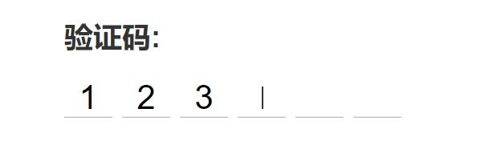

# label 标签

## How？label与表单元素绑定的两种方式
- 隐式绑定：将表单控件作为 label 的内容，此时不需要 for 属性，绑定的控件也不需要 id 属性。
```
<label>Date of Birth: <input type="text" name="DofB" /></label>
```

- 显式绑定：为```<label>```标签下的 for 属性命名一个目标表单的 id。
```
<label for="SSN">Social Security Number:</label>
<input type="text" name="SocSecNum" id="SSN" />
```

## Why？ 将label与表单元素绑定有什么用呢？
label与表单元素绑定后，你点击这个标签的时候，所绑定的元素将获取焦点。

如：点击 Male，就可以让 input 框聚焦
```
<label for="male">Male</label>
<input type="radio" name="sex" id="male" />
```

## Demo
[Web 端 实现 app “输入验证码 ”的效果](https://juejin.im/post/5acc3a3f51882555867fbe8a?utm_medium=fe&utm_source=weixinqun)


### 原理
- 隐藏input框，使用input记录验证码数据。
- 6位密码，每个对应一个label。
- 点击label时，让input获得焦点，允许用户输入。
- 焦点闪烁效果是使用css animate动画模拟出来的。

### HTML结构
```
<div class="v-code">
  <input
    ref="vcode"
    id="vcode"
    type="tel"
    maxlength="6"
    v-model="code"
    @focus="focused = true"
    @blur="focused = false"
    :disabled="telDisabled">
    <label
      for="vcode"
      class="line"
      v-for="item,index in codeLength"
      :class="{'animated': focused && cursorIndex === index}"
      v-text="codeArr[index]"
    >
  </label>
</div>
```