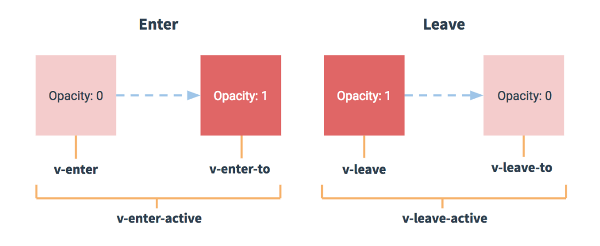

# Vue入门

## Vue 组件库
WEB端
- [Element UI](http://element-cn.eleme.io/#/zh-CN)
- [iview]()

移动端
- [Vant](https://youzan.github.io/vant/#/zh-CN/intro)
- [Mint UI](http://mint-ui.github.io/#!/zh-cn)

## 组件通信
- 父子组件通信
- 兄弟组件通信
- slot组件与外层组件的通信

### 通信方式
- 事件绑定(this.$on 和 this.$emit)，可用于父子组件通信。
- 事件总线(eventBus)，可用于兄弟组件通信。
- 状态管理器(Vuex)，均可。

## 利用Object.freeze()提升性能
vue 1.0.18+对其提供了支持，对于data或vuex里使用freeze冻结了的对象，vue不会做getter和setter的转换。  
场景：
- 纯展示的大数据，并且确信数据不会修改。
- 使用第三方插件创建的对象，例如使用echarts创建的地图对象等。
```js
new Vue({
    data: {
        // vue不会对list里的object做getter、setter绑定
        list: Object.freeze([
            { value: 1 },
            { value: 2 }
        ])
    },
    created () {
        // Object.freeze()冻结的是值，你仍然可以将变量的引用替换掉，从而实现数据响应
        this.list = [
            { value: 100 },
            { value: 200 }
        ];
        this.list = Object.freeze([
            { value: 100 },
            { value: 200 }
        ]);
    }
})
```

## Vue动画
在哪些情况下，Vue会给元素或组件添加动画？
- 条件渲染 (使用 v-if)
- 条件展示 (使用 v-show)
- 动态组件
- 组件根节点

transition 组件
- name，设置过渡类的前缀(默认为 v-)
- 设置自定义过渡类的类名
- 设置初始渲染动画，及其自定义 CSS 类名
- 设置类型，值可以是 transition 或 animation
- 显示设置过渡的时间，单位毫秒
- javascript钩子函数
```html
<transition
  name="fade"
  enter-active-class="animated tada"
  leave-active-class="animated bounceOutRight"
  appear
  appear-class="custom-appear-class"
  appear-to-class="custom-appear-to-class"
  appear-active-class="custom-appear-active-class"
  type="transition"
  :duration="1000"
  v-on:before-enter="beforeEnter"
  v-on:enter="enter"
  v-on:after-enter="afterEnter"
  v-on:enter-cancelled="enterCancelled"
>
  <div></div>
</transition>
```

过度的类名：


CSS过渡
```css
.slide-fade-enter-active {
  transition: all .3s ease;
}
.slide-fade-leave-active {
  transition: all .8s cubic-bezier(1.0, 0.5, 0.8, 1.0);
}
.slide-fade-enter, .slide-fade-leave-to{
  transform: translateX(10px);
  opacity: 0;
}
```

CSS动画
```css
.bounce-enter-active {
  animation: bounce-in .5s;
}
.bounce-leave-active {
  animation: bounce-in .5s reverse;
}
@keyframes bounce-in {
  0% {
    transform: scale(0);
  }
  50% {
    transform: scale(1.5);
  }
  100% {
    transform: scale(1);
  }
}
```

## 参考文档

