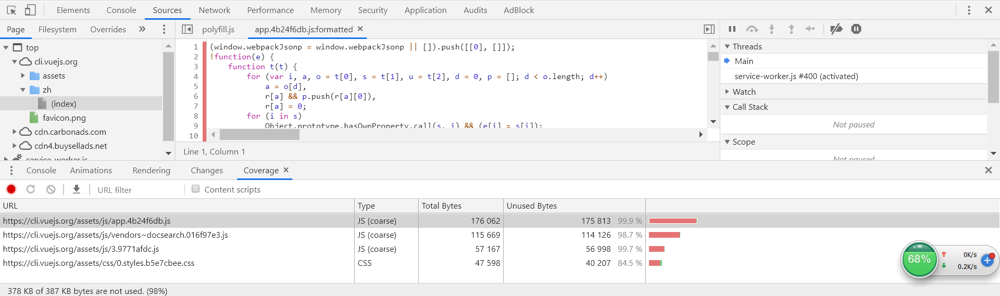

# webpack 核心概念
- webpack只支持js/json类型的文件，对于其他webpack不支持的文件类型（如css/ts/image/less等），需要通过loader转换成有效的模块。

## Questions？
- webpack-cli 有什么用？

## webpack 的安装
- 全局安装。缺点：所有项目只能使用同一个版本的 webpack。
- 局部安装。局部安装时，使用``` npx webpack xxx``` 可执行 webpack 命令。

## webpack 支持哪些模块规范？
- ES6 Modules
- CommonJS
- AMD

## Entry和Output
```
{
  entry: {
    main: './src/index.js'
  },
  output: {
    filename: '[name].js',  // 用于给 entry 中配置的文件命名，[name] 表示 entry 对象中的 key。
    chunkFilename: '[name].chunk.js',   // 用于给非 entry 中配置的文件命名
    path: path.resolve(__dirname, 'dist'),   // 打包后文件的输出目录，即文件在硬盘中的存储位置
    publicPath: 'https://cdn.example.com/assets/',  // 静态资源最终访问路径 = output.publicPath + 资源loader或插件等配置的路径
  }
}
```
- output.filename 当 entry 中配置的入口文件 > 1 时，需要使用占位符
- path 与 publicPath 的区别

## devtool 与 sourceMap
- source-map，会生成一个 .js.map 文件
- cheap，与source-map的区别在于cheap生成的.map文件会忽略原始代码中的列信息。
- inline，与source-map不同，增加inline属性后，不会生成独立的.map文件，而是将.map文件以dataURL的形式插入到bundle中。
- module？
- eval，eval模式会把每个 module 封装到 eval 里包裹起来执行，并且会在末尾追加注释。
```
webpackJsonp([1],[
  function(module,exports,__webpack_require__){
    eval(
      ...
      //# sourceURL=webpack:///./src/js/index.js?'
    )
  }
...])
```
推荐：
- 开发环境：cheap-module-eval-source-map
- 生产环境：cheap-module-source-map

## webpack-dev-server
注意：使用前需要先安装 webpack-dev-server。
```js
// webpack.config.js
var path = require('path');
module.exports = {
  devServer: {
    contentBase: path.join(__dirname, 'dist'),
    compress: true,
    port: 9000
  }
};
```
package.json
```
"scripts": {
  "start": "webpack-dev-server --open",
}
```

## Development和Production模式区分打包
- webpack.common.js 公共配置文件
- webpack.dev.js  开发模式配置文件
- webpack.prod.js 生产模式配置文件
```js
// 以 webpack.dev.js 为例
import merge from 'webpack-merge';  // 使用 webpack-merge 合并多个配置文件
const commConfig = require("./config/webpack.common.js");
const developmentConfig = {
  // ...
}
module.exports = merge(commConfig, developmentConfig)
```
```
{
  "scripts": {
    "dev": "webpack-dev-server --config ./config/webpack.dev.js",
    "build": "webpack --config ./config/webpack.dev.js"
  }
}
```

## SplitChunksPlugin 配置
打包流程：
1. 首先判断模块A，是否需要进行代码分割。
2. 然后根据 cacheGroups 的配置，判断模块A应该放到哪个组里面。
3. 如果模块A没有匹配到任何一个 cacheGroup，那么模块A就不会被分割。
```
{
  splitChunks: {
    chunks: 'all',
    cacheGroups: {
      // 只有 node_modules 下的模块会匹配到 vendors 这个组。
      vendors: {
        test: /[\\/]node_modules[\\/]/,
        priority: -10
      },
      // default 没有配置 test 属性，则所有的模块都会匹配到 default 这个组
      default: {
        minChunks: 2,
        priority: -20,
        reuseExistingChunk: true
      }
    }
  }
}
```
- chunks。async：只对异步代码进行分割，all：针对所有代码，initial：对同步代码进行分割。
- minChunks 模块被引用的次数 >= minChunks时，才会进行代码分割
- maxAsyncRequests 最大同时请求数
- maxInitialRequests 在入口文件中引入的多个模块，最多能被分割成 maxInitialRequests 个
- automaticNameDelimiter 组和文件名之间的连接符，如：vendors~main.js
- cacheGroups 需要进行代码分割的模块，到底如何分割？这就需要根据 cacheGroups 的配置来判断。
    - priority 优先级，当某个模块满足多个 cacheGroup 时，会被打包到优先级更高的组里面。
    - reuseExistingChunk 如果一个模块已经被打包过了，则不进行重复打包。
    
## Lazy loading 懒加载
- 魔法注释 /* webpackChunkName="lodash" */
- import 懒加载
```js
import(/* webpackChunkName:"lodash" */ 'lodash').then(({ default: _ }) => {
  console.log(_.join(['Dell', 'Lee']))
})
async function getComponent() {
  const { default: _ } = await import(/* webpackChunkName:"lodash" */ 'lodash')
  console.log(_.join(['Dell', 'Lee']))
}
```
- dynamicImport：babel-plugin-dynamic-import-webpack，不支持魔法注释
- plugin-syntax-dynamic-import，支持魔法注释

## 打包分析
- [analyse](https://github.com/webpack/analyse)
```
webpack --profile --json > stats.json
```
- webpack-bundle-analyzer

### 代码覆盖率 coverage
- 通过谷歌控制台，可以看到js文件的代码覆盖率，点击具体文件，还可以看到哪些代码使用，哪些还没有使用。

- 通过代码覆盖率，可以看到哪些代码没有立即执行，对于这些代码，可以考虑提取出来，放到一个单独的文件中，使用异步加载。同时配合 prefetch ，在网络带宽有空闲时，提前加载。
- Prefetch
```js
import(/* webpackPrefetch: true */ 'LoginModal');
// <link rel="prefetch" href="login-modal-chunk.js">
```

## externals
如果在 externals 中配置了 jquery 模块，那么 jquery 就不会被打包到 bundle 中，而是在运行时(runtime)再去从外部获取这些扩展依赖。
```js
// import $ from 'jquery';
externals: {
  jquery: 'jQuery'
}
```

## resolve 解析
- extensions 能够使用户在引入模块时不带扩展
- mainFiles 解析目录时要使用的文件名
- alias 别名

## 参考文档
- [Asset Management](https://webpack.js.org/guides/asset-management/)
- [Webpack文档](https://doc.webpack-china.org/)
- [Awesome Webpack](https://github.com/webpack-contrib/awesome-webpack)
- [Webpack 教程资源收集](https://segmentfault.com/a/1190000005995267)
- [Vue+Webpack开发可复用的单页面富应用教程](https://zhuanlan.zhihu.com/p/21702056)
- [Webpack实战-构建离线应用](https://segmentfault.com/a/1190000012556968)
- [webpack 应用编译优化之路](https://juejin.im/post/59dc57f2f265da431d3ba2ef)

