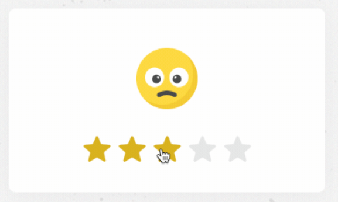

# 纯CSS动画

## 通过点击进行交互
代表作：[《给个好评嘛》作者：Mert Cukuren](https://codepen.io/knyttneve/pen/EBNqPN)

label的背景图片是星星。点击 label 能选中对应的 input，然后通过 input 是否被选中 :checked，来控制 label 背景图片的切换和表情的位移。
```html
<input type="radio" name="rating" id="rating-5">
<label for="rating-5"></label>  
<input type="radio" name="rating" id="rating-4">
<label for="rating-4"></label>
```
知识点：
- 当 label 的 for 属性值等于 input 的 id 时，点击 label 能选中对应的 input。
- :checked 选择器，能匹配界面上处于选中状态的元素。
- 兄弟选择符(E~F)，选择E元素后面的所有兄弟元素F。因此在这个动画中，DOM的元素的属性一次是：第5颗、第4颗、第3颗、第2颗、第1颗星星。

