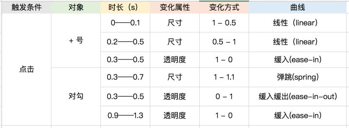

# 动效落地

## 参考文档
- [最全最好用的动效落地方法、都帮你总结好了（下）](https://zhuanlan.zhihu.com/p/34815524)
- [动态效果设计指南](https://github.com/MartinRGB/MTGuideline/wiki/1.0-Motion-Design-%E8%A7%84%E8%8C%83%E7%BB%BC%E8%BF%B0)
- [Framer（framerjs.com）如何入门？](https://www.zhihu.com/question/24325481/answer/57158319)

## 对接困难
让设计师可以轻松地描述动效，让开发可以准确地还原动效。

### 动效量化
- 变化。变化可以划分为四类，这四类变化基本涵盖了界面元素的全部运动方式。
  - 位移
  - 旋转
  - 尺寸
  - 透明度
- 时长。标注清楚动效的起始时间和终止时间。
- 曲线。曲线描述的是物体运动时候的速度变化。例如 linear，ease-in，ease-out 等。  

标注的时候要把该元素的动效三要素 —— 变化 、时长、曲线 都分别标出来。如下图
  

## 设计方法与工具
最传统普遍应用的动效设计工具是 After Effects，因为可能很多设计师在之前就有使用的经验，但它也有不符合当下需求的缺点：不能交互、产出物不好量化、难分享。

### 自动导出类
目前，有像 Lottie、Keyframes 等开源库，通过 AE 插件，将在 AE 中设计的动效自动导出为前端可用的动效文件，前端只需要在项目中打入对应的开源库，就可以免去对接交流的苦恼。  
虽然看上去十分简洁美好，但是这种方案的应用场景是有限的：仅适合应用在纯动效元素（例如动态 ICON），无法用于 UI 的界面元素。对 AE 的效果支持也有限，并不是有了库就能为所欲为。  
但总的来说，自动导出类方案可以在纯动态元素的场景下大大提升工作效率，产品性能。相比 Gif 或者帧序列，导出的 json 文件容量小，在端上显示质量高。

### 可交互类
目前应用较广的包括 Principle、Flinto、Framer、Origami 等等。相比传统工具，这些新的工具无一例外加入了可交互的特性，让我们可以对产品的交互流进行设计和模拟。
- Framer，用代码构建、基于 Web，所有 Web 支持的效果，Framer 都可以做到，自由度极高，而且设计产出可以通过一个网址快速分享，让整条产品线上的人都可以低成本体验你的动效设计。

## 开发
动画的实现、常用的有以下几种。
- CSS 动画
- 开源库。[lottie-web](https://github.com/airbnb/lottie-web)、Keyframe 类开源库。
- 序列帧。序列帧可以理解为跑马灯、具体实现方式是提供一张动画的帧序列拼图、通过 CSS 和 JS 控制它逐帧播放。跟交互动效不太一样、序列帧动画一般用在运营页面的动画里。补充一个制作序列帧的工具 [gka](https://gka.js.org/#/)

