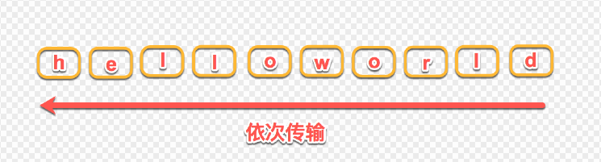

# http2

## 参考文档
- [浅析HTTP/2的多路复用](https://segmentfault.com/a/1190000011172823)

## http2与http1.x的区别
- 传输格式
  - HTTP2采用二进制格式传输。
  - HTTP1.x采用文本格式传输。

## 多路复用
多路复用，就是在一个TCP连接中可以同时传输多个请求和响应，之间互不干扰。

### http2如何实现多路复用？
在HTTP1.x的协议中，请求和响应都是采用文本格式进行传输的，因此所有的数据必须按顺序传输，比如需要传输：hello world，只能从h到d一个一个的传输，不能并行传输，因为接收端并不知道这些字符的顺序，所以并行传输在HTTP1.1是不能实现的。

- 二进制数据帧。每个帧会标识出该帧属于哪个流，所以这些帧是可以交错传输，然后在接收端通过帧头的信息组装成完整的数据。
- 流。每一个TCP连接中承载了多个双向流通的流，每一个流都有一个独一无二的标识和优先级，而流就是由二进制帧组成的。
- 通过数据帧和流，http2就实现了多路复用，即同域名下的所有通信都在一个TCP连接上完成。

