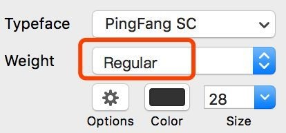
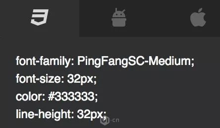

# font-weight 字重

## 设计师眼中的字重


```css
div{
  font-family: PingFangSC;
  font-weight: 500;  /* 将字重转换成 font-weight*/
}
```

## font-weight值与字重的对应关系
- 100 - Thin
- 200 - Extra Light (Ultra Light)
- 300 - Light
- 400 - Regular (Normal、Book、Roman)
- 500 - Medium
- 600 - Semi Bold (Demi Bold)
- 700 - Bold
- 800 - Extra Bold (Ultra Bold)
- 900 - Black (Heavy)

