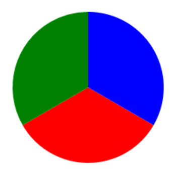
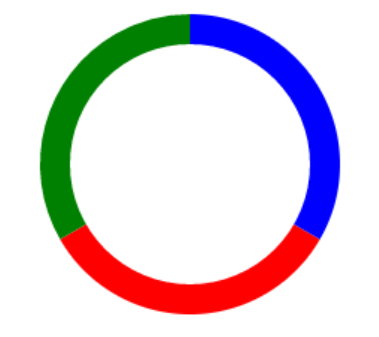

# 使用 Canvas 绘制扇形

## 参考文档
1. [如何在 Canvas 中绘制扇形](http://www.clanfei.com/2014/12/1745.html)

## 绘制扇形
```js
CanvasRenderingContext2D.prototype.sector = function(x, y, radius, sAngle, eAngle, counterclockwise) {
  this.beginPath();
  // 移动到圆心
  this.moveTo(x, y);
  // 绘制圆弧
  this.arc(x, y, radius, sAngle, eAngle, counterclockwise);
  // 闭合路径，创建从当前点回到起始点的路径。
  this.closePath();
  return this;
};
let canvas = document.getElementById('canvas');
let ctx = canvas.getContext('2d');
ctx.sector(50, 50, 50, 0, Math.PI * 1.5).fill()
```

## 实心饼状图

```js
ctx.fillStyle = 'red';
ctx.sector(50,50,50,30,150).fill();
ctx.fillStyle = 'green';
ctx.sector(50,50,50,150,270).fill();
ctx.fillStyle = 'blue';
ctx.sector(50,50,50,270,390).fill();
```

## 空心饼状图

```js
ctx.fillStyle = 'red';
ctx.sector(50,50,50,30,150).fill();
ctx.fillStyle = 'green';
ctx.sector(50,50,50,150,270).fill();
ctx.fillStyle = 'blue';
ctx.sector(50,50,50,270,390).fill();
// 在饼状图上添加一个白色的圆，这样的话，饼状图就变成了空心饼状图了
ctx.fillStyle = '#fff';
ctx.sector(50,50,30,0,360).fill();
```

## 扇形动画
```js
eAngle = 0;
let draw = function(){
  let start = eAngle * Math.PI;
  eAngle = eAngle + 0.01;
  let end = eAngle * Math.PI;
  ctx.sector(50, 50, 50, start, end).fill();
  time = requestAnimationFrame(draw);
  if(eAngle >= 2){
    eAngle = 0;
    // 清空画布
    ctx.clearRect(0,0,100,100);
    // cancelAnimationFrame(time)
  }
}
let time = requestAnimationFrame(draw)
```

## 圆环百分比进度条


