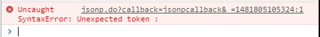
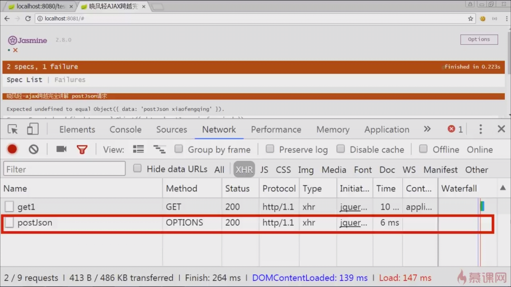
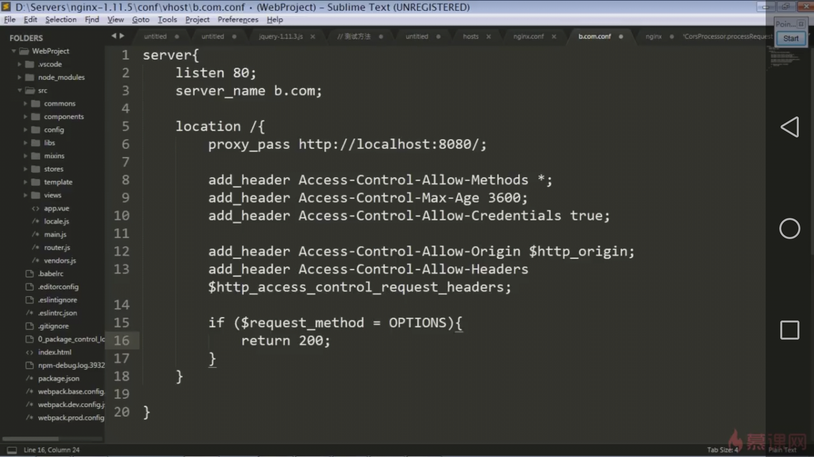
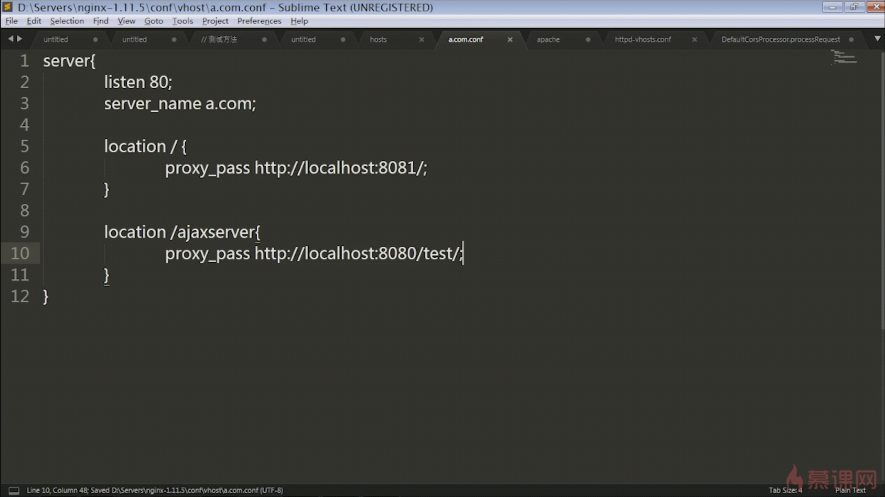

## CORS（跨域资源共享） ##

### 为什么会发生跨域？
- 浏览器限制
- 跨域（协议、域名、端口，任意一个不同，就会发生跨域）
- XHR（XMLHttpRequest）请求。  
    json、script 请求不会发生跨域问题。
```
// 这种标签是不会遇到"跨域"问题的
<script type="text/javascript" src="http://www.a.com/scripts/1.js"></script>

<link rel="stylesheet" href="http://www.c.com/assets/css/1.css" />
```

### 如何解决跨域问题？
| 针对的问题 | 解决方案 | 备注  |
| --------- | ------- | --------- |
| 针对浏览器限制 | 禁止浏览器跨域检查 | [--disable-web-security](https://www.cnblogs.com/zhongxia/p/5416024.html)  |
| 针对XHR 请求 | 使用 JSONP | JSONP 不是 XHR 请求 |
| 针对跨域 | 1）被调用方允许跨域。2）调用方隐藏跨域 | 

### JSONP
JSONP实现跨域请求的原理：  
【原理】：Ajax 的跨域受到“同源策略”的限制，但是像 ```<script>``` 及 `````` 标签带有 src 属性，都可不受限制地其他域中加载资源，JSONP 则是通过动态 ```<script>``` 元素来使用的。  
【实现方式】：jsonp跨域请求的关键就在于：服务端要在返回的数据外层包裹一个客户端已经定义好的函数。如：
```
callback( {"result":"success"} )
```

使用 jQuery 发送 JSONP 请求：
```
$.ajax({
    url: '...',
    dataType: 'jsonp',  // 预期服务器返回的数据类型
    jsonp: 'callback',  // 默认是 callback，JSONP回调参数的名称，即前后端约定的字段名
    cache: true,    // 是否启用缓存
    success: function(){
        // ....
    }
})
```

JSONP有什么弊端？
- 服务器需要改动代码支持。  
    服务端不能返回 JSON 对象。因为我们请求的数据会立马被浏览器当作javascript语句去执行（谁让我们用 script 去请求数据呢）
    
    在支持Spring MVC的项目中，可以在服务端添加一个JSONP的切面去处理JSONP响应。
- 只支持GET。即使把请求类型设置为post，其本质上仍然是一个get请求。
- 发送的不是 XHR 请求。JSONP不是一种标准协议，其安全性和稳定性不太好。

### 简单请求和非简单请求
简单请求：  
- 方法为：GET、HEAD、POST
- 请求 header 里面：
    1) 无自定义头
    2) Content-Type 为以下几种：  
        text/plain  
        multipart/form-data  
        application/x-www-form-urlencoded

非简单请求：
- PUT、DELETE方法的 ajax 请求
- 发送 json 格式的 ajax 请求
- 带自定义头的 ajax 请求

浏览器在发送跨域请求时，会先判断是简单请求还是非简单请求。  
简单请求：先执行在检查。  
非简单请求：先发送预检命令，再执行。



### 跟跨域有关的响应头
// 允许跨域的域名，
Access-Controll-Allow-Origin
// 允许跨域的请求方法
Access-Controll-Allow-Method
// 允许的头，多个以逗号分隔
Access-Controll-Allow-Headers
// 可以用于缓存预检命令，单位为秒
Access-Controll-Max-Age
// 带 Cookie 跨域时，需要将这个 header 设置为 true
Access-Controll-Allow-Credentials: true

### 带 Cookie 的跨域
注意：
1. 跨域请求时，携带的是被调用方的 cookie，即 b.com
2. 带 cookie 跨域时，Access-Controll-Allow-Origin 不能设置通配符 *
```
$.ajax({
    ...
    url: 'b.com/test/getCookie.do',
    xhrFields: {
        withCredentials: true
    }
})
```

### 被调用方（服务端）允许跨域

1. 使用 Filter

2. [nginx 解决方案](https://www.imooc.com/video/16591)


3. [apache 解决方案](https://www.imooc.com/video/16592)

4. Spring 框架解决方案
在 requestMapping 中使用注解。 @CrossOrigin  
[Spring MVC 从4.2版本开始增加了对CORS的支持](https://my.oschina.net/wangnian/blog/689020)


### 调用方隐藏跨域
1. nginx 反向代理

html, css等资源位于 localhost:8081 服务。  
restful接口位于 localhost:8080/test 服务。

```
// 约定请求地址以 /ajaxserver 开头，将这个地址代理到 localhost:8080 服务上
$.ajax({
    ...
    url: '/ajaxserver/getXXX.do',
})
```

2. apache 反向代理


参考文档：
1. [CORS预检请求详谈](http://www.cnblogs.com/wonyun/p/CORS_preflight.html)
2. [跨域资源共享 CORS 详解](http://www.ruanyifeng.com/blog/2016/04/cors.html)
3. [SpringMvc解决跨域问题](https://my.oschina.net/wangnian/blog/689020)
4. [ajax跨域完全讲解](https://www.imooc.com/learn/947)