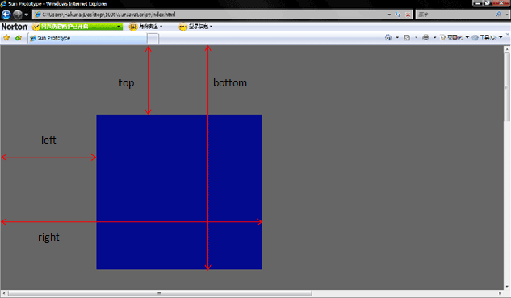

## 页面尺寸和位置

### 参考文档
1. [width、naturalWidth、clientWidth、offsetWidth区别整理](https://segmentfault.com/a/1190000013772038)

### 元素
- element.clientHeight	返回元素的可见高度。  
- element.clientWidth	返回元素的可见宽度。  
clientWidth = content + padding；不包括垂直滚动条（如果有）、边框和外边距。该属性值会被四舍五入为一个整数。如果你需要一个小数值，可使用 element.getBoundingClientRect() 方法。

- element.offsetWidth	返回元素的宽度。  
一个典型的（译者注：各浏览器的 offsetWidth 可能有所不同）offsetWidth = content + padding + border；

- element.offsetHeight	返回元素的高度。  

偏移位置
- element.offsetParent	返回元素的偏移容器。  
- element.offsetTop	返回元素的垂直偏移位置。  
- element.offsetLeft	返回元素的水平偏移位置。  

滚动条相关
- element.scrollWidth 元素的整体宽度  
- element.scrollHeight 元素的整体高度  
- element.scrollTop 元素滚动条纵坐标的位置  
- element.scrollLeft 元素滚动条横坐标的位置  

### getBoundingClientRect
getBoundingClientRect 用于获得页面中某个元素的左，上，右和下分别相对浏览器视窗的位置（不包含文档卷起的部分）。  
其中 right 和 bottom 的理解有些不同。right是指元素右边界距窗口最左边的距离，bottom是指元素下边界距窗口最上面的距离。


### 窗口
使用 document.body 或 document.documentElement 去获取宽高值。

可视区域相关
- document.body.clientWidth
- document.body.clientHeight
- document.body.offsetWidth
- document.body.offsetHeight

屏幕相关
- window.screen.height 屏幕分辨率的高
- window.screen.width 屏幕分辨率的宽
- window.screen.availHeight 屏幕可用工作区高度
- window.screen.availWidth 屏幕可用工作区宽度

#### document.body 和 document.documentElement 的区别？
document.body 是指的 ```<body>``` 标签，document.body.clientHeight 获取到的是 body 的高度。w3c标准文档模式，document.body.scrollTop的值是为 0。    
document.documentElement 是指 ```<html>``` 标签，document.documentElement.clientHeight 获取到的是整个 html 的高度。怪癖模式下，document.documentElement.scrollTop 获取到属性的值是为 0。  
因此为了好的兼容性，我们可以这样写：
```
var top = document.documentElement.scrollHeight || document.body.scrollHeight
```

### MouseEvent
clientX 鼠标相对于窗口客户区域的 x 坐标，其中客户区域不包括窗口自身的控件和滚动条。  
clientY 鼠标相对于窗口客户区域的 y 坐标，其中客户区域不包括窗口自身的控件和滚动条。  
offsetX 鼠标相对于触发事件的对象的 x 坐标。  
offsetY 鼠标相对于触发事件的对象的 y 坐标。  
screenX 鼠标相对于用户屏幕的 x 坐标。  
screenY 鼠标相对于用户屏幕的 y 坐标。  
x 鼠标相对于父文档的 x 像素坐标。  
y 鼠标相对于父文档的 y 像素坐标。  
