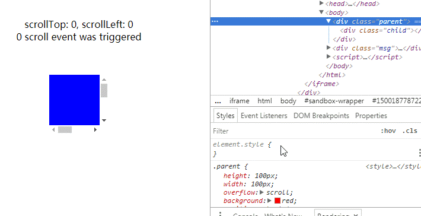
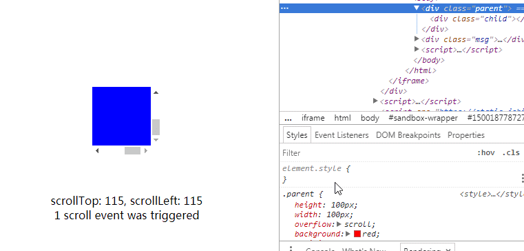

## 巧妙监测元素尺寸变化

### 参考文档
1. [巧妙监测元素尺寸变化](https://blog.crimx.com/2017/07/15/element-onresize/)
2. [Cross-Browser, Event-based, Element Resize Detection](http://www.backalleycoder.com/2013/03/18/cross-browser-event-based-element-resize-detection/)
3. [javascript-detect-element-resize](https://github.com/sdecima/javascript-detect-element-resize)，包括纯 js 版本和 jQuery 版本。（基于方案一）

### How 方案一：使用滚动事件(scroll)，来实现 resize 事件的监测
原理：  
在被监测元素里包裹一个跟元素位置大小相同的隐藏块。隐藏块可以滚动，并有一个远远大于它的子元素。当被监测元素尺寸变化时期望能触发隐藏块的滚动事件。

注意事项：  
如果直接这么实现会发现时而行时而不行，问题就在于触发滚动事件的条件。

#### 触发滚动事件的条件
根据前面的整体思路，当被监测元素尺寸发生变化时，隐藏元素也跟着变化。于是引发了 Layout/Reflow 使到重新计算滚动位置 position。  
但这时也许你会发现 position 根本没有变化，如下图。


Qustion：如何保证每次元素尺寸变化时，滚动位置 position 也发生变化？  
1.让元素滚到最尽头，那么 scrollTop 和 scrollLeft 达到了最大值。当容器尺寸变大时，因为子元素的尺寸是固定的，故 scrolling area 的大小不变，所以两者的差变小了，scrollTop 和 scrollLeft 得到新的最小值，发生了滚动。


2.当容器尺寸变小时，如果保证 position 发生变化？

### How 方案二：通过一个隐藏的 object 元素，触发 resize 事件
参考文档：[Cross-Browser, Event-based, Element Resize Detection](http://www.backalleycoder.com/2013/03/18/cross-browser-event-based-element-resize-detection/)  

原理：  
在被监测元素里包裹一个跟元素位置大小相同的 object 元素。当被监测元素尺寸变化时，object 元素的尺寸也会跟着改变，从而触发 object 的 resize 事件。  
```<object>```标签，可以定义一个嵌入的对象，当 type 为 text/html 时，嵌入的就是一个 html 文档，可以在这个 html 文档的 window 对象上，绑定 resize 事件。

```
(function(){
  var attachEvent = document.attachEvent;
  var isIE = navigator.userAgent.match(/Trident/);
  console.log(isIE);
  var requestFrame = (function(){
    var raf = window.requestAnimationFrame || window.mozRequestAnimationFrame || window.webkitRequestAnimationFrame ||
        function(fn){ return window.setTimeout(fn, 20); };
    return function(fn){ return raf(fn); };
  })();
  
  var cancelFrame = (function(){
    var cancel = window.cancelAnimationFrame || window.mozCancelAnimationFrame || window.webkitCancelAnimationFrame ||
           window.clearTimeout;
    return function(id){ return cancel(id); };
  })();
  
  function resizeListener(e){
    var win = e.target || e.srcElement;
    if (win.__resizeRAF__) cancelFrame(win.__resizeRAF__);
    win.__resizeRAF__ = requestFrame(function(){
      var trigger = win.__resizeTrigger__;
      trigger.__resizeListeners__.forEach(function(fn){
        fn.call(trigger, e);
      });
    });
  }
  
  // object 元素，onload 处理函数；
  function objectLoad(e){
    this.contentDocument.defaultView.__resizeTrigger__ = this.__resizeElement__;
    // object 加载完以后，在它 window 对象上，添加 resize 事件，监听尺寸变化。
    this.contentDocument.defaultView.addEventListener('resize', resizeListener);
  }
  
  window.addResizeListener = function(element, fn){
    if (!element.__resizeListeners__) {
      element.__resizeListeners__ = [];
      if (attachEvent) {
        element.__resizeTrigger__ = element;
        element.attachEvent('onresize', resizeListener);
      }
      else {
        if (getComputedStyle(element).position == 'static') element.style.position = 'relative';
        var obj = element.__resizeTrigger__ = document.createElement('object'); 
        obj.setAttribute('style', 'display: block; position: absolute; top: 0; left: 0; height: 100%; width: 100%; overflow: hidden; pointer-events: none; z-index: -1;');
        obj.__resizeElement__ = element;
        // 给 object 添加 onload 事件
        obj.onload = objectLoad;
        // 设置 object 的 type 为 'text/html'
        obj.type = 'text/html';
        if (isIE) element.appendChild(obj);
        obj.data = 'about:blank';
        if (!isIE) element.appendChild(obj);
      }
    }
    element.__resizeListeners__.push(fn);
  };
  
  window.removeResizeListener = function(element, fn){
    element.__resizeListeners__.splice(element.__resizeListeners__.indexOf(fn), 1);
    if (!element.__resizeListeners__.length) {
      if (attachEvent) element.detachEvent('onresize', resizeListener);
      else {
        element.__resizeTrigger__.contentDocument.defaultView.removeEventListener('resize', resizeListener);
        element.__resizeTrigger__ = !element.removeChild(element.__resizeTrigger__);
      }
    }
  }
})();
```
