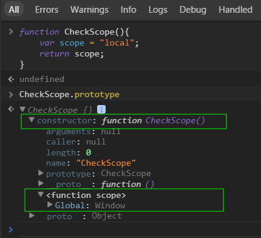

## 作用域 ##

### 作用域  
作用域就是变量和函数的可访问范围，控制着变量和函数的可见性与生命周期，在JavaScript中变量的作用域有全局作用域和局部作用域。

### 作用域链
作用域链的创建规则：
* 当定义一个函数时;  
在函数内部会创建一个 [[Scope]] 属性，这个属性指向一条作用域链。  
作用域链创建规则如下：从函数内部向外遍历，每当碰到一个function {...} 时，就将其对应的变量对象添加至作用域链中去，如此下去，直到 window 对象，然后将作用域链的引用赋给 [[Scope]] 属性。

* 当调用这个函数时  
解释器会先创建一个新的变量对象，然后将这个变量对象的添加至上面那个作用域链的栈顶，此后将函数内部的[[Scope]]属性直接赋值给执行环境的[[Scope]]属性。

* 当函数执行完之后  
对应的函数执行环境会被销毁，但该执行函数所对应的变量对象却不一定会被销毁，  
这时就会发生闭包现象。

### [[Scope]]属性 
该内部属性包含了函数被创建的作用域中对象的集合，这个集合被称为函数的作用域链，它决定了哪些数据能被函数访问。

参考文档：
1. [深刻理解JS的作用域链](https://www.jianshu.com/p/181da2b57eb2)