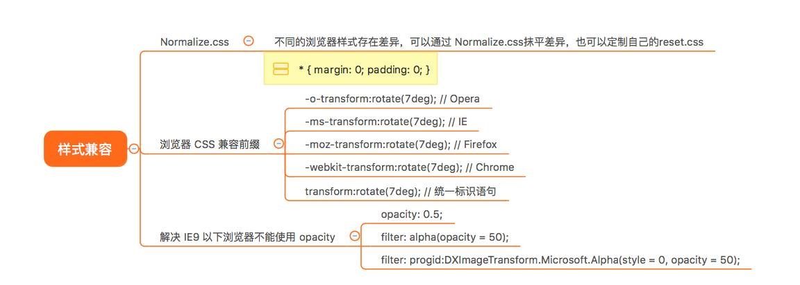
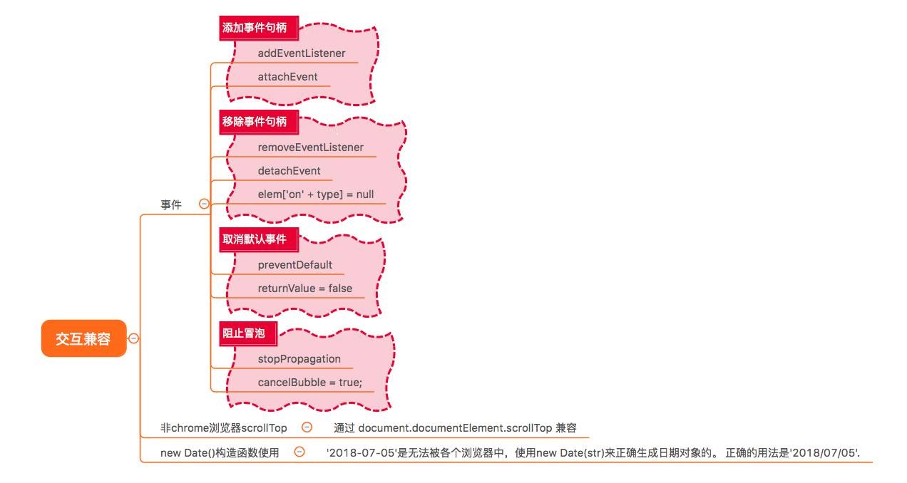
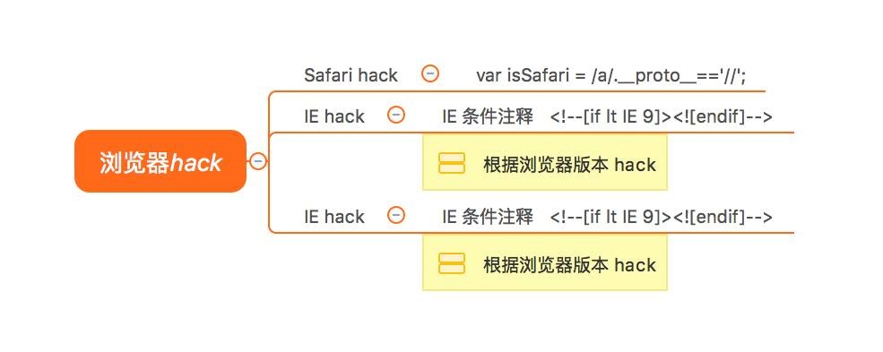

# 浏览器兼容性

| 插件 | 描述 | 浏览器的版本 |
| ---- | ---- | ----------- | 
| html5shiv.js | 
| respond.js

## 参考文档
- [如何机智地回答浏览器兼容性问题](https://juejin.im/post/5b3da006e51d4518f140edb2)

## JS-兼容性处理
### [Polyfill.io - 自动化的 JavaScript Polyfill 服务](https://c7sky.com/polyfill-io.html)
[Polyfill.io](https://polyfill.io/v2/docs/features/) 通过分析请求头信息中的 UserAgent 实现自动加载浏览器所需的 polyfills。  
使用 Polyfill.io，你只需要引入一个 JS 文件。
```html
<script src="https://cdn.polyfill.io/v2/polyfill.min.js"></script>
```
你也可以通过传递 features 参数来自定义功能列表：
```html
<!-- 加载 Promise&fetch -->
<script src="https://cdn.polyfill.io/v2/polyfill.min.js?features=Promise,fetch"></script>
```


## 样式兼容性（css）方面


## 交互兼容性（javascript）


- 事件兼容的问题，我们通常需要会封装一个适配器的方法，过滤事件句柄绑定、移除、冒泡阻止以及默认事件行为处理
```
var  helper = {}

//绑定事件
helper.on = function(target, type, handler) {
 	if(target.addEventListener) {
 		target.addEventListener(type, handler, false);
 	} else {
 		target.attachEvent("on" + type,
 			function(event) {
 				return handler.call(target, event);
      }, false);
 	}
};

//取消事件监听
helper.remove = function(target, type, handler) {
 	if(target.removeEventListener) {
 		target.removeEventListener(type, handler);
 	} else {
 		target.detachEvent("on" + type,
 	    function(event) {
 			return handler.call(target, event);
 		}, true);
  }
};
```

- 获取 scrollTop 通过 document.documentElement.scrollTop 兼容非chrome浏览器
```
var scrollTop = document.documentElement.scrollTop||document.body.scrollTop;
```

## 浏览器 hack


- 判断是否是 Chrome 浏览器
```
/* Chrome */
var isChrome = Boolean(window.chrome);
```

## IE
对于IE浏览器，用最新的渲染模式渲染：
```
<meta http-equiv= "x-ua-compatible" content= "ie=edge">
```

在 header 标签中加入下面这段代码：
```
<!--[if lt IE 9]>
  <script src="http://apps.bdimg.com/libs/html5shiv/3.7/html5shiv.min.js"></script>
 <![endif]-->
```
* lt < 小于  
* gt > 大于  
* lte <= 小于或等于  
* gte >= 大于或等于 


参考文档：
