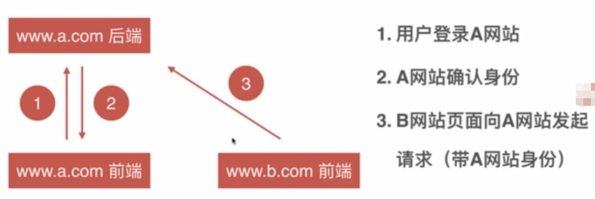

# CSRF Cross Site Request Forgy 跨站请求伪造
在其他网站对目标网站发了请求。

## 原理

## 危害
- 利用用户登录态
- 用户不知情
- 完成业务请求
- 盗取用户资金（转账、消费）
- 冒充用户发帖背锅
- 损害网站名誉
- 。。。

## 防御
- 禁止第三方网站带 Cookies。  
给Cookie设置SameSite属性：
    - SameSite=Strict 严格模式，表明这个 cookie 在任何情况下都不可能作为第三方 cookie，绝无例外。
    - SameSite=Lax 宽松模式
- 在前端页面加入验证信息
    - 图片验证码
    - token
- 验证referer