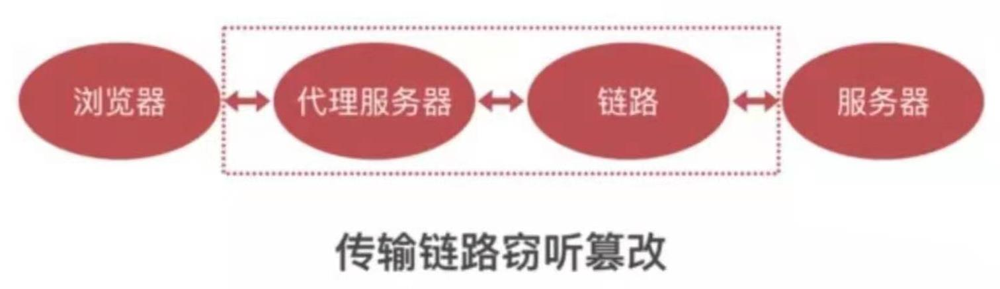
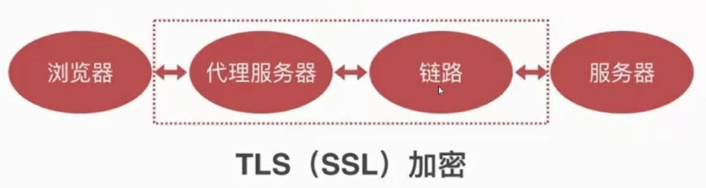
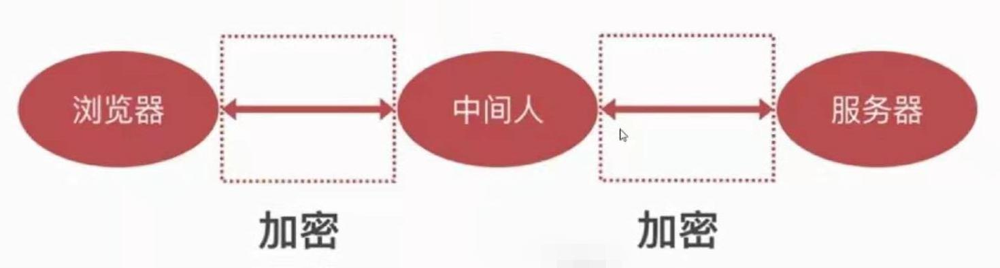
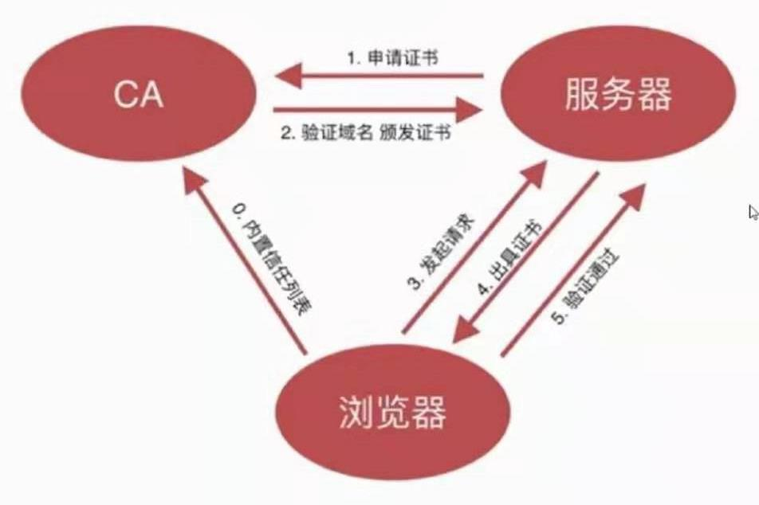

# 传输安全

## HTTP窃听
- 窃听用户密码
- 窃听敏感信息
- 非法获取个人资料

## HTTP篡改
- 插入广告
- 重定向网站
- 无法防御XSS和CSRF攻击

## 案例
- 运营商劫持
- 局域网劫持
- 公共wifi获取密码

## HTTPS

中间人攻击

引入证书机制，解决信任问题

- 证书无法伪造
- 证书私钥不能泄漏
- 域名管理权不能泄漏
- CA坚守原则，不能滥发证书。CA一定要做先验证域名，通过后才能发证书。
