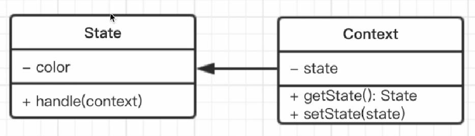

# 状态模式

## 介绍
一个对象有状态变化，每次状态变化都会触发一个逻辑，不能总是用 if...else 控制逻辑。

## 场景
- 有限状态机
- 写一个简单 promise

## UML类图


## 实现
交通信号灯，使用状态模式实现：
```js
class State{
  constructor(color){
    this.color = color;
  }
  handle(context){
    console.log('color', this.color)
  }
}
class Context{
  constructor() {
    this.state = null;
  }
  getState(){
    return this.state;
  }
  setState(state){
    this.state = state;
  }
}

let context = new Context();
let red = new State('red')
let green = new State('green')
let yellow = new State('yellow')
// 绿灯亮了
green.handle(context);
```