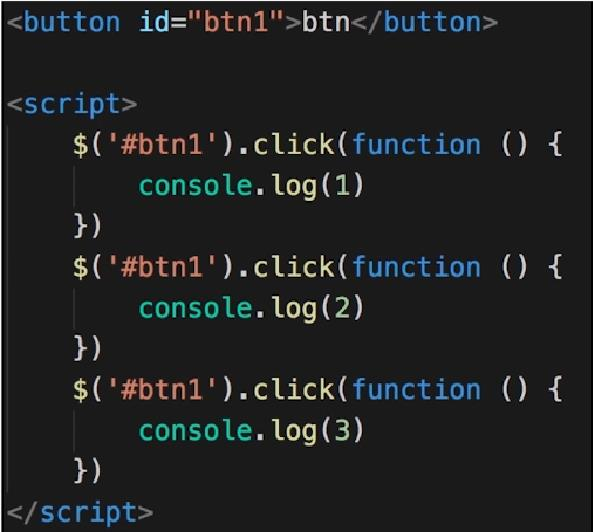
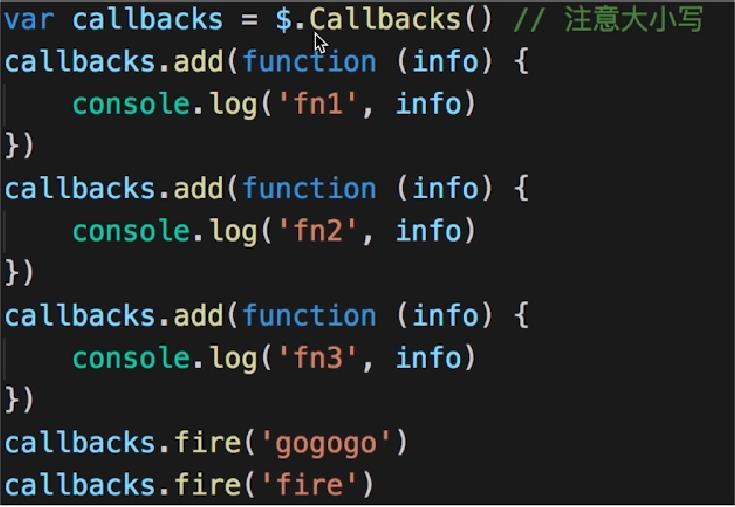
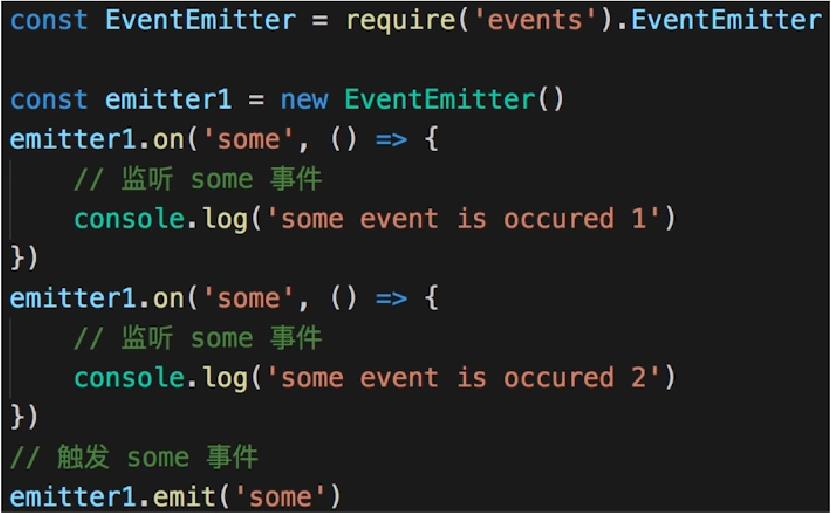
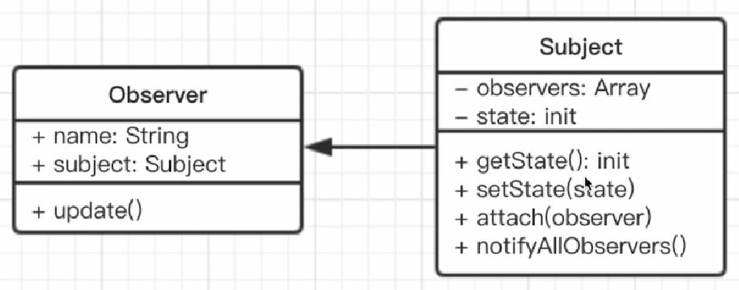

# 观察者模式

## 介绍
- 发布&订阅
- 1对N

## 场景
- 网页事件绑定

- Promise？ Q：Promise 也是观察者模式？
- jQuery callbacks

- nodejs 自定义事件

- vue watch

## UML类图


## 实现
```js
// 主题，保存状态，状态变化后触发所有的观察者对象
class Subject {
  constructor(){
    this.state = 0;
    this.observers = []
  }
  getState(){
    return this.state
  }
  setState(state){
    this.state = state;
    this.notifyAllObservers()
  }
  notifyAllObservers(){
    this.observers.forEach(observer => {
      observer.update()
    })
  }
  attach(observer){
    this.observers.push(observer)
  }
}
class Observer {
  constructor(name, subject){
    this.name = name;
    this.subject = subject;
    this.subject.attach(this)
  }
  update(){
    console.log('update')
  }
}
```
