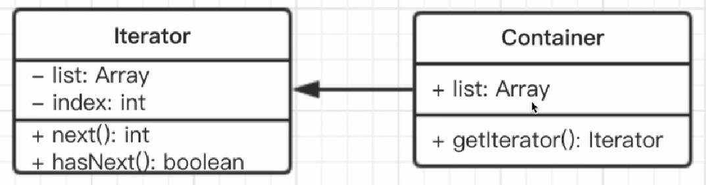

# 迭代器模式

## 介绍
顺序访问一个集合，使用者无需知道集合的内部结构

## 场景
- jQuery each
- ES6 Iterator？

## UML类图


## 实现
```js
class Iterator {
  constructor(container){
    this.list = container.list;
    this.index = 0;
  }
  next(){
    if(this.hasNext()){
      return this.list[index ++];
    }
    return null;
  }
  hasNext(){
    if(this.index >= this.list.length){
      return false
    }
    return true;
  }
}
class Container {
  constructor(list){
    this.list = list;
  }
  getIterator(){
    return new Iterator(this)
  }
}
```