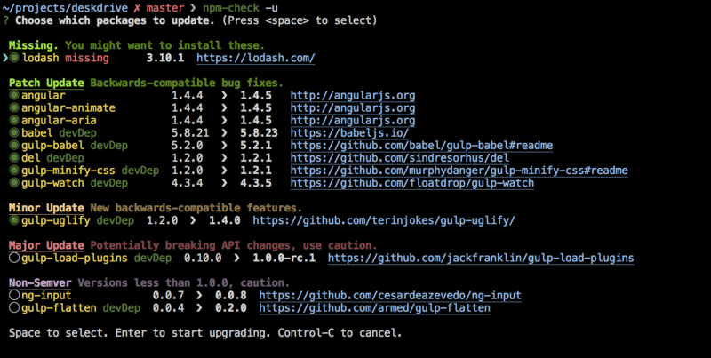

## Node.js 工具

### npm模块升级工具 [npm-check](https://github.com/dylang/npm-check)
提供命令行下的图形界面，可以手动选择升级哪些模块。


安装
```
$ npm install -g npm-check
```
使用
```
$ npm-check
```

### npm模板升级工具 [npm-check-updates](https://github.com/tjunnone/npm-check-updates)
	
