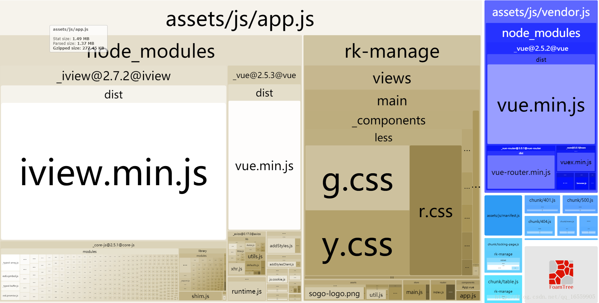

## Webpack 性能优化

- [Webpack打包后体积过大的优化思路](https://blog.csdn.net/chencl1986/article/details/73835739)
- [查看 webpack 打包后所有的依赖关系（webpack 可视化工具）](https://blog.csdn.net/qq_16559905/article/details/78551719)  
- [webpack优化的工具](https://survivejs.com/webpack/optimizing/build-analysis/)
- [webpack-libs-optimizations](https://github.com/GoogleChromeLabs/webpack-libs-optimizations#core-js)

### 1. webpack-bundle-analyzer


使用和安装  
```
npm install --save-dev webpack-bundle-analyzer
```  

在webpack.config.js中：
```
let BundleAnalyzerPlugin = require('webpack-bundle-analyzer').BundleAnalyzerPlugin;

module.exports = {
    plugins: [new BundleAnalyzerPlugin()]
}
```
启动服务：

生产环境查看：npm run build --report 或 正常build 即可启动查看器。

开发环境查看：webpack -p --progress 或启动正常devServer服务即可启动查看器!

### 2. webpack官网提供的工具


### 备忘录
- [使用LsLoader优化webpack2应用加载性能，实现按chunks加载web应用](https://zhuanlan.zhihu.com/p/25012345)
- externals + CDN
- [使用可视化图表对 Webpack 2 的编译与打包进行统计分析](https://www.cnblogs.com/libin-1/p/7027164.html)