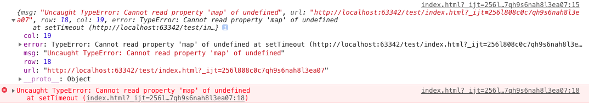
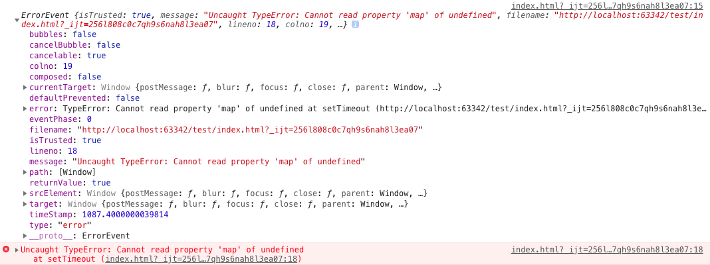
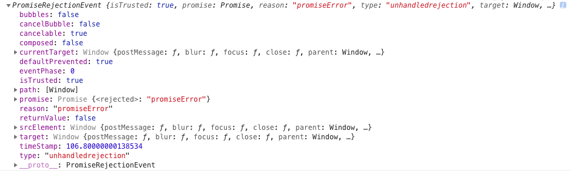

# 错误监控

## 目录
- [前端错误分类](#前端错误分类)
- [错误的捕获方式](#错误的捕获方式)
- [上报错误的基本原理](#上报错误的基本原理)

## 前端错误分类
- 即时运行错误：代码错误
- 资源加载错误

## 错误的捕获方式
- 即时运行错误的捕获方式
  - try...catch
  - window.onerror，注意：window.onerror不会去捕获到Promise里面的错误
- 资源加载错误
  - object.onerror
  - performance.getEntries()
  - Error事件捕获
- 跨域的js运行错误
  - 在script标签增加 crossorigin 属性
  - 设置js资源响应头 Access-Control-Allow-Origin: '*'

## 上报错误的基本原理
- 采用 Ajax 通信的方式上报
- 利用 Image 对象上报

## window.onerror
```js
window.onerror = function (msg, url, row, col, error){
   // 可以捕获异步函数中的错误信息并进行处理，提示Script error.
   console.log({msg, url, row, col, error});
};

setTimeout(function() {
    console.log(obj);   // 可以被捕获到，并在onerror中处理
}, 200);
```


## addEventListener
addEventListener 可以捕获运行错误、资源加载错误、未 catch 的 promise 错误。
```js
// 注意：要在捕获阶段，而不是冒泡阶段执行事件
window.addEventListener('error', (e) => {
  console.log(e);
}, true);
```


```js
// 捕获未 catch 的 promise 错误
window.addEventListener("unhandledrejection", e => {
  e.preventDefault();
  console.log(e);
});
Promise.reject('promiseError');
```


## 参考文档
- [前端错误日志收集方案](https://juejin.im/post/5bd2dbc7f265da0af16183f8)
- [前端错误收集（Vue.js、微信小程序）](https://juejin.im/post/5c0f19dff265da61461e0140)
- [从无到有<前端异常监控系统>落地](https://juejin.im/post/5a3dca226fb9a04515441686)
- [把前端监控做到极致](http://d2forum.alibaba-inc.com/#/index?_k=ommzyi)
- [Sentry第三方开源工具](https://sentry.io/welcome/)

