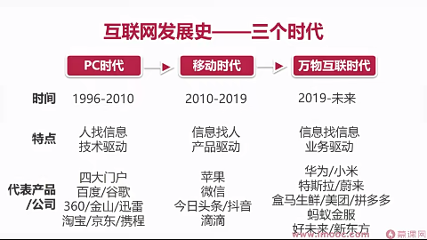
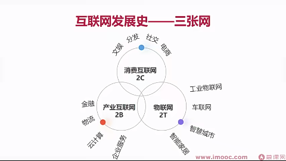
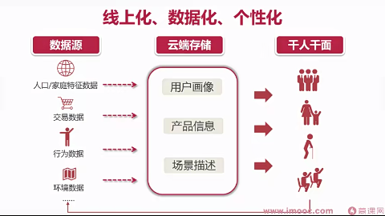
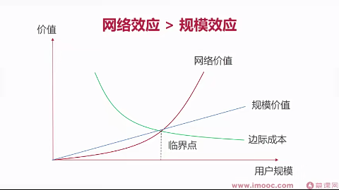
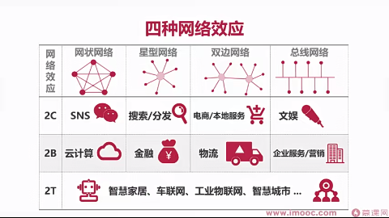
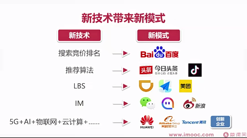
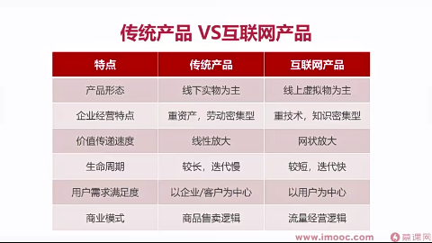

# 了解互联网和互联网产品

- 互联网的发展史：PC时代、移动时代、万物互联时代
  
- 互联网的三张网：消费互联网、产业互联网、物联网
  
- 互联网的特点
  - 数据智能：线上化、数据化、个性化
    
  - 网络效应 > 规模效应
    
    
  - 模式创新：新技术带来新模式
    
  - 拥抱变化

# 产品与产品经理
- 传统产品与互联网产品
  
- 产品经理的特点
  - 好奇心
  - 同理心
  - 逻辑思维能力
  - 组织协调能力

# 用户思维