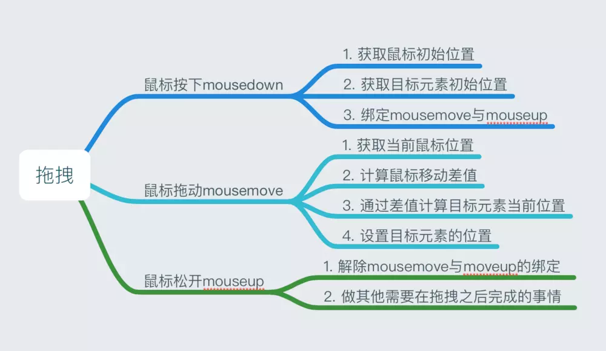

# 拖拽对象

## 参考文档
1. [前端基础进阶（十）：面向对象实战之封装拖拽对象](https://www.jianshu.com/p/b3dee0e84454)
2. [Demo地址](https://codepen.io/yangbo5207/pen/LWjWpe)

## 拖拽的原理
```
移动后的鼠标位置 - 鼠标初始位置 = 移动后的目标元素位置 - 目标元素的初始位置
```
那么目标元素的位置就等于：
```
dis = 移动后的鼠标位置 - 鼠标初始位置;  // 鼠标位置的差值
移动后目标元素的位置 = dis + 目标元素的初始位置
```

## 使用思维导图梳理代码逻辑

