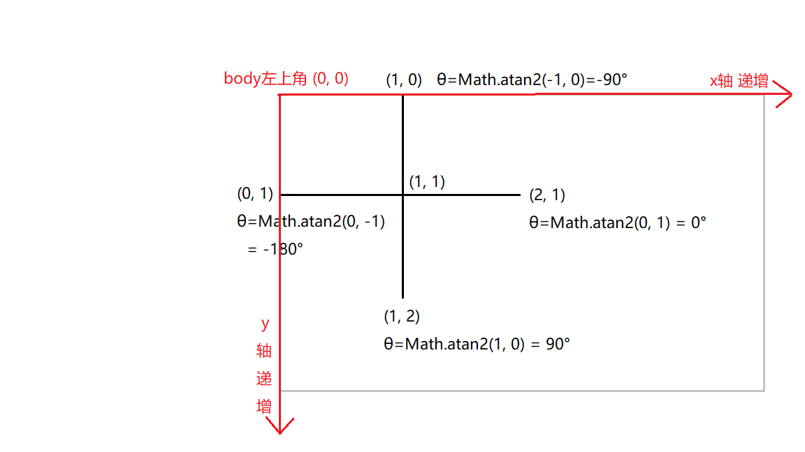
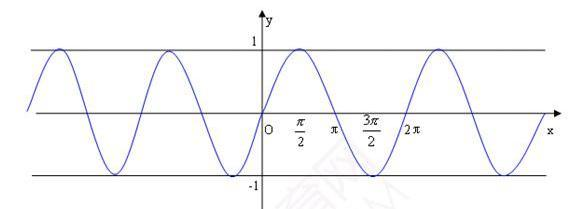

# 三角函数

## 参考文档
1. [《每周一点canvas动画》——波形运动](https://segmentfault.com/a/1190000004956705)
2. [《每周一点canvas动画》——三角函数](https://segmentfault.com/a/1190000004922024/)

## 三角函数

- sinθ=∠θ的对边/斜边，即sinθ = x / R。
- cosθ=∠θ的邻边/斜边，即cosθ = y / R。
- tanθ=∠θ的对边/临边，即tanθ = x / y。
Q：如何通过已知的距离(因为坐标的位置很好确定)来推出角度。

## Math类中的三角函数
弧度与角度的关系：弧度 = 角度 × π / 180。
- Math类中采用的是弧度制。如：Math类的sin(x)中的 x 参数是弧度。
- canvas中采用的是弧度制。
```js
// 需要将角度转换成弧度
Math.sin( θ * Math.PI/180 );  // sin(θ)
Math.cos( θ * Math.PI/180 );  // cos(θ)
Math.tan( θ * Math.PI/180 );  // tan(θ)
// 计算角度
θ = Math.asin(x/R) * (180/Math.PI);  // θ = arcsin(x/R)
θ = Math.acos(y/R) * (180/Math.PI);  // θ = arccos(y/R)
θ = Math.atan(x/y) * (180/Math.PI);  // θ = arctan(x/y)
```

### 根据位置计算角度
注意参数的顺序，先是纵坐标y，然后是横坐标x。
```js
// atan2 得到的是弧度值，还需要将弧度转成角度
var rad = Math.atan2(dy, dx);
// 转成对应的角度值
var rot = rad * (180 / Math.PI);
```


### 正弦函数 sin()


## 三角函数的应用
### 1.眼珠跟随鼠标旋转
[Eyes follow mouse Demo](https://codepen.io/J-Roel/pen/wWGNQN)
[自己动手写的Demo](https://codepen.io/shawnfung/pen/oaBybj)
这个 Demo 实际上就是根据鼠标的位置设置两个眼球的 transform: rotate 属性做的效果。
动效的重点：
- 如何根据位置计算角度？利用 Math.atan2()
- 眼球的初始位置，应该是在东边，即x轴的正方。
```html
<div class="box">
  <div class="eye">
  </div>
</div>
```
```css
body{
  height: 100vh;
  padding-top: 40px
}
.box{
  position: relative;
  box-sizing: border-box;
  width: 30px;
  height: 30px;
  background: #e5e5e5;
  border-radius: 50%;
  transform-origin: 15px 15px;
  margin: 0 auto;
}
.eye{
  /* 注意，眼球的初始位置，在x轴正方向。*/
  position: absolute;
  width: 10px;
  height: 10px;
  right: 4px;
  top: 10px;
  background: black;
  border-radius: 50%;
}
```
```js
var $eye = $('.box');
var eyeX = $eye.offset().left + $eye.width() / 2;
var eyeY = $eye.offset().top + $eye.height() / 2;
$('body').on('mousemove', function(event){
  // 得到弧度值
  var rad = Math.atan2(event.pageY - eyeY, event.pageX - eyeX);
  // 转成对应的角度值
  var rot = rad * (180 / Math.PI);
  // 设置眼球的转动角度，rotate 值
  $eye.css('transform', 'rotate(' + rot + 'deg)' )
})
```


