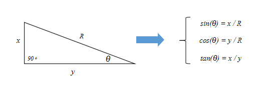

# 三角函数

## 参考文档
1. [《每周一点canvas动画》——波形运动](https://segmentfault.com/a/1190000004956705)
2. [《每周一点canvas动画》——三角函数](https://segmentfault.com/a/1190000004922024/)

## 三角函数

- sinθ=∠θ的对边/斜边，即sinθ = x / R。
- cosθ=∠θ的邻边/斜边，即cosθ = y / R。
- tanθ=∠θ的对边/临边，即tanθ = x / y。
Q：如何通过已知的距离(因为坐标的位置很好确定)来推出角度。

## Math类中的三角函数
弧度与角度的关系：弧度 = 角度 × π / 180。
- Math类中采用的是弧度制。如：Math类的sin(x)中的 x 参数是弧度。
- canvas中采用的是弧度制。
```js
// 需要将角度转换成弧度
Math.sin( θ * Math.PI/180 );  // sin(θ)
Math.cos( θ * Math.PI/180 );  // cos(θ)
Math.tan( θ * Math.PI/180 );  // tan(θ)
// 计算角度
θ = Math.asin(x/R) * (180/Math.PI);  // θ = arcsin(x/R)
θ = Math.acos(y/R) * (180/Math.PI);  // θ = arccos(y/R)
θ = Math.atan(x/y) * (180/Math.PI);  // θ = arctan(x/y)
```

根据位置计算角度，注意参数的顺序，先是纵坐标y，然后是横坐标x。
```js
Math.atan2(dy, dx);
```


### 正弦函数 sin()


## 三角函数的应用
### 1.眼珠跟随鼠标旋转
[Eyes follow mouse Demo](https://codepen.io/J-Roel/pen/wWGNQN)
这个 Demo 实际上就是根据鼠标的位置设置两个眼球的 transform: rotate 属性做的效果。
动效的重点：
- 如何根据位置计算角度？利用 Math.atan2()
- 如何将 Math.atan2() 得到的角度值，转换成 rotate 对应的旋转值。

