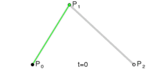
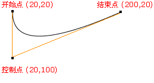

# 贝塞尔曲线
贝塞尔曲线（Bezier curve）是计算机图形学中相当重要的参数曲线，它通过一个方程来描述一条曲线，根据方程的最高阶数，又分为线性贝赛尔曲线，二次贝塞尔曲线、三次贝塞尔曲线和更高阶的贝塞尔曲线。  
贝塞尔曲线在线绘制工具：
- [在线绘制工具1，推荐](http://wx.karlew.com/canvas/bezier/)
- [在线绘制工具2](http://myst729.github.io/bezier-curve/)
- [cubic-bezier](http://cubic-bezier.com/#.91,-0.33,0,1.16)

## 二阶贝塞尔曲线
  
二次贝塞尔曲线由三个点P0,P1,P2来确定，其实P0为开始点，P1为控制点，P2为结束点。

### 在Canvas中绘制二阶贝塞尔曲线
```js
ctx.quadraticCurveTo(cpx,cpy,x,y);
```
第一个点是用于二次贝塞尔计算中的控制点，第二个点是曲线的结束点。曲线的开始点是当前路径中最后一个点。如果路径不存在，那么请使用 beginPath() 和 moveTo() 方法来定义开始点。

- 定义开始点：moveTo(20,20)
- 绘制贝塞尔曲线：quadraticCurveTo(20,100,200,20)

## 三阶贝塞尔曲线
```js
ctx.bezierCurveTo(cp1x,cp1y,cp2x,cp2y,x,y);
```
前两个点是用于三次贝塞尔计算中的控制点，第三个点是曲线的结束点。曲线的开始点是当前路径中最后一个点。如果路径不存在，那么请使用 beginPath() 和 moveTo() 方法来定义开始点。

- 定义开始点：moveTo(20,20)
- 绘制贝塞尔曲线：bezierCurveTo(20,100,200,100,200,20)

## 参考文档
