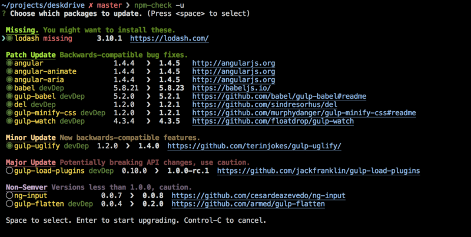

# Node.js 工具

## npm模块升级工具 [npm-check](https://github.com/dylang/npm-check)
提供命令行下的图形界面，可以手动选择升级哪些模块。


安装
```
$ npm install -g npm-check
```
使用
```
$ npm-check
```

## npm模板升级工具 [npm-check-updates](https://github.com/tjunnone/npm-check-updates)


## localtunnel：把本机服务暴露到外网
```
npm install -g localtunnel
```
localtunnel能够让你快速的把本机的服务暴露到公网上，提供给其他人使用、测试，不需要任何域名、虚拟主机。典型的使用场景比如做前端开发的同学可以利用这个工具把开发环境的服务提供给 PM 或者 QA 验收使用。提供类似服务的还有 ngrok 及其国内克隆版 natapp，但是都是收费的。

## nodemon：自动重启 NodeJS 应用
```
npm install -g nodemon
```
nodemon 是一款监听服务运行时所在的目录源代码变化并自动重启服务的工具，是项目快速迭代时的完美伴侣，因为 nodemon 能帮你把重复工作降到最低。理论上 nodemon 支持各种语言的服务重启，并且支持监听目录和文件的自定义配置。

## standard：傻瓜式的 Javascript 语法检查工具
```
npm install -g standard
```
standard 是代码检查工具领域的新秀，代码检查存在的必要性这里不再赘述。在代码风格检查领域有几款优秀的工具，按出现的先后顺序为：jslint、jshint、eslint，而跟 standard 同时出现的还要很多其他的，他的特点是傻瓜式，零配置即可上手，目前在已经有不少开源项目使用了这种风格，无需任何配置，只需要用过命令行就可以确保所有的代码贡献者提交的代码是风格一致的。
	
	
# 移动端调试
## 参考文档
1. [移动端调试痛点？——送你五款前端开发利器](https://juejin.im/post/5b72e1f66fb9a009d018fb94)

## 1. [vConsole](https://github.com/Tencent/vConsole)
```html
<script src="path/to/vconsole.min.js"></script>
<script>
  // init vConsole
  var vConsole = new VConsole();
  console.log('Hello world');
</script>
```

## 2. [eruda](https://github.com/liriliri/eruda)
```html
<script src="path/to/eruda.min.js"></script>
<script>
  eruda.init();
</script>
```

## 3. 调试 Android，可以利用 Chorme 浏览器的 remote debug 功能
具体操作，请移步参考文档[1]

## 4. 调试 IOS，可以利用 safari 浏览器的开发功能
具体操作，请移步参考文档[1]

## 5. [spy-debugger](https://github.com/wuchangming/spy-debugger)
微信调试，各种WebView样式调试、手机浏览器的页面真机调试。便捷的远程调试手机页面、抓包工具，支持：HTTP/HTTPS，无需USB连接设备。

# 抓包工具

## [Charles](https://www.cnblogs.com/rrl92/p/7928770.html)

## Fiddler
