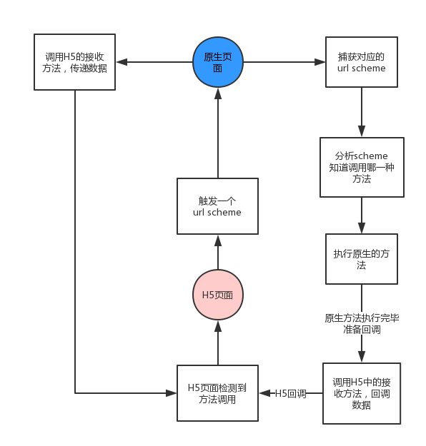

# H5与Native交互

## 
原生和前端的交互有两种方式：url scheme以及JavaScriptCore（在Android中是addJavascriptInterface）

## url scheme
一般情况下，url scheme 是一种类似于 url 的链接，是为了方便 app 直接互相调用设计的。  
注意⚠️： ️iOS10以后，urlscheme必须符合url规范，否则会报错。  
Q：scheme 必须原生 app 注册吗？

基本原理：
```
H5 -> 触发一个url（每一个功能代表的url都不同）-> Native端捕获到url -> Native端分析属于哪一个功能并执行 -> Native端调用H5中的方法将执行结果回调给H5
```


相比于其它方案的优点：
- Android4.2 以下，addJavascriptInterface 方式有安全漏掉
- iOS7 以下，JavaScriptCore 无法使用  

所以如果需要兼容这类型低版本的机型，url scheme方案是不二选择  

## H5直接与Native交互
分别包括Android，iOS中H5和原生互相调用，总结如下：
- H5调Android-原生通过addJavascriptInterface注册，然后H5直接调用
- Android调H5-原生通过loadUrl来调用H5，4.4及以上还可以通过evaluateJavascript调用
- H5调iOS-原生通过JavaScriptCore注册（需ios7以上），然后H5直接调用
- iOS调H5-通过stringByEvaluatingJavaScriptFromString