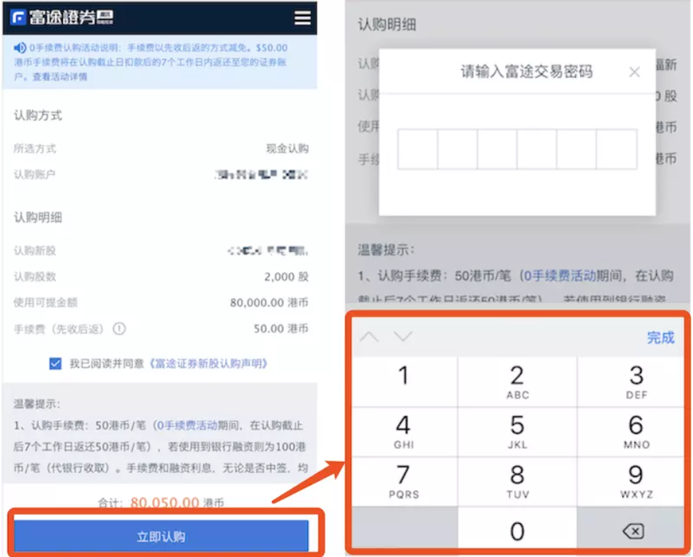
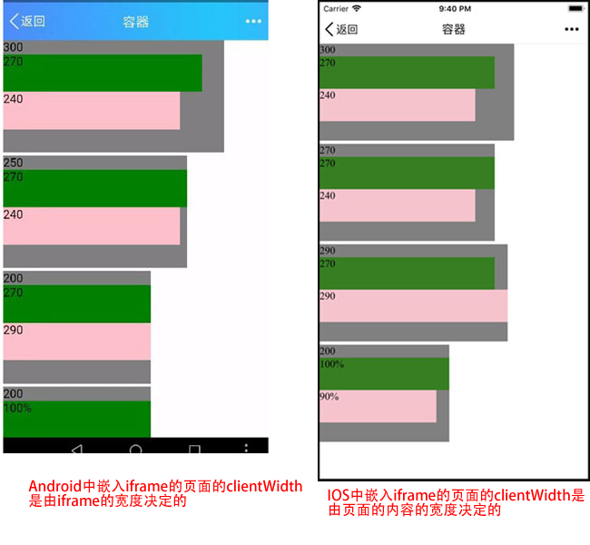
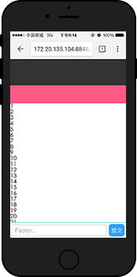

# 移动端开发总结

## 参考文档
1. [Web移动端Fixed布局的解决方案](http://efe.baidu.com/blog/mobile-fixed-layout/)
2. [移动端踩坑之旅-ios下fixed、软键盘相关问题总结](https://blog.csdn.net/gg464556/article/details/77949185)

## meta基础知识

## 样式部分
- a标签、input框被点击时，会出现一个灰色背景
```css
a,button,input,optgroup,select,textarea {
    -webkit-tap-highlight-color:rgba(0,0,0,0); /*去掉a、input和button点击时的蓝色外边框和灰色半透明背景*/
}
```

- 移动端如何清除输入框内阴影
```css
input,
textarea {
　　border: 0; /* 方法1 */
　　-webkit-appearance: none; /* 方法2 */
}
```

- 去除 button在 ios上的默认样式
```css
button{
  -webkit-appearance: none;
  border-radius: 0;
}
```

- 如何修改 placeholder 的样式
```css
input::-webkit-input-placeholder{ 
  color:#AAAAAA; 
}
input:focus::-webkit-input-placeholder{ 
  color:#EEEEEE; 
}
```

- 移动端placeholder没有垂直居中


- 滚动不流畅
```
-webkit-overflow-scrolling: touch;
```

## html部分
- winphone系统a、input标签被点击时产生的半透明灰色背景怎么去掉
```html
  <meta name="msapplication-tap-highlight" content="no">
```

- 关闭iOS键盘首字母自动大写
```html
<input type="text" autocapitalize="off" />
```

- 关闭iOS输入自动修正
```html
<input type="text" autocorrect="off" /> 
```

- 移动端调用数字键盘
```html
<!--当用户设置搜狗为默认输入法，拉起的软键盘是搜狗输入法，考虑到第三方输入法有记录密码的风险，当用于密码输入时，不建议采用这种方案-->
<input placeholder="输入数字" type="text" pattern="[0-9]*">
<!--拉起的软键盘永远是原生的9宫格键盘，当用于密码输入时，可以采用这种方案-->
<input placeholder="输入数字" type="tel">
```

## js部分
### 移动端click屏幕产生200-300 ms的延迟响应
fastclick可以解决在手机上点击事件的300ms延迟。

### 点击穿透  
问题常见发生场景： 假如页面上有两个元素A和B。B元素在A元素之上。我们在B元素的touchstart事件上注册了一个回调函数，该回调函数的作用是隐藏B元素。我们发现，当我们点击B元素，B元素被隐藏了，随后，A元素触发了click事件。  
这是因为在移动端浏览器，事件执行的顺序是touchstart > touchend > click。  
而click事件有300ms的延迟，当touchstart事件把B元素隐藏之后，隔了300ms，浏览器触发了click事件，但是此时B元素不见了，所以该事件被派发到了A元素身上。如果A元素是一个链接，那此时页面就会意外地跳转。   

解决思路：
1. 不要混用touch和click 
2. 消耗掉touch之后的click  

解决方法：
1. 只用touch，把页面内所有click全部换成touch事件（ touchstart 、’touchend’、’tap’），注意：a标签的href也是click，需要换成js的跳转。 
2. 改动最小——350ms后再隐藏B元素

### 点击按钮，自动拉起软键盘
需求如下：点击立即认购按钮，弹出密码框，聚焦密码输入框，并拉起软键盘。

- 一般做法：给立即认购添加 click 事件，在事件处理函数中，手动让密码输入框聚焦，即：```$input.focus(); ```，pc端可以正常执行，但是在移动端却不能正常拉起软键盘。
- 原因分析：软键盘只有在用户手动touch输入框foucus的时候才会弹起。  
- 做法：把一个透明的input，覆盖在目标按钮上，当用户点击的时候，其实点击的是input输入框。，拉起软键盘后，可以通过JavaScript执行focus()聚焦到其他输入框，并保证软键盘不会收起，并且可以正常对聚焦的输入框进行输入。


## IOS
### 1.软键盘唤起后，页面的 fixed 元素将失效.
软键盘唤起后，页面的 fixed 元素将失效（ios认为用户更希望的是元素随着滚动而移动，也就是变成了 absolute 定位），既然变成了absolute，所以当页面超过一屏且滚动时，失效的 fixed 元素就会跟随滚动了。  
不仅限于 type=text 的输入框，凡是软键盘（比如时间日期选择、select 选择等等）被唤起，都会遇到同样地问题。
#### 解决方案一
假如页面不会过长出现滚动，那么即便 fixed 元素失效，也无法跟随页面滚动，也就不会出现上面的问题了。  
如果使 fixed 元素的父级不出现滚动，而将原 body 滚动的区域域移到 main 内部。

### 2.软键盘唤起问题，只有用户主动的操作才会允许唤起键盘
解决方案：覆盖一个透明的 input 框。

### IOS中嵌入在iframe中的页面的clientWidth是由页面本身的内容宽度决定的和父页面的iframe的宽度没有关系
[示例](https://newbieyoung.github.io/SomeBugs/bug-about-iframe-clientwidth-in-ios/container.html);


## Android

## IOS和Android都会碰到的问题
### 输入框 focus 以后，会出现软键盘遮挡输入框的情况。
可以尝试 input 元素的 scrollIntoView 进行修复。

### 在页面滚动到上下边缘的时候，如果继续拖拽会将整个 View 一起拖拽走，导致页面的"露底"。
  
为了防止页面露底，可以在页面拖拽到边缘的时候，通过判断拖拽方向以及是否为边缘来阻止 touchmove 事件，防止页面继续拖拽。

