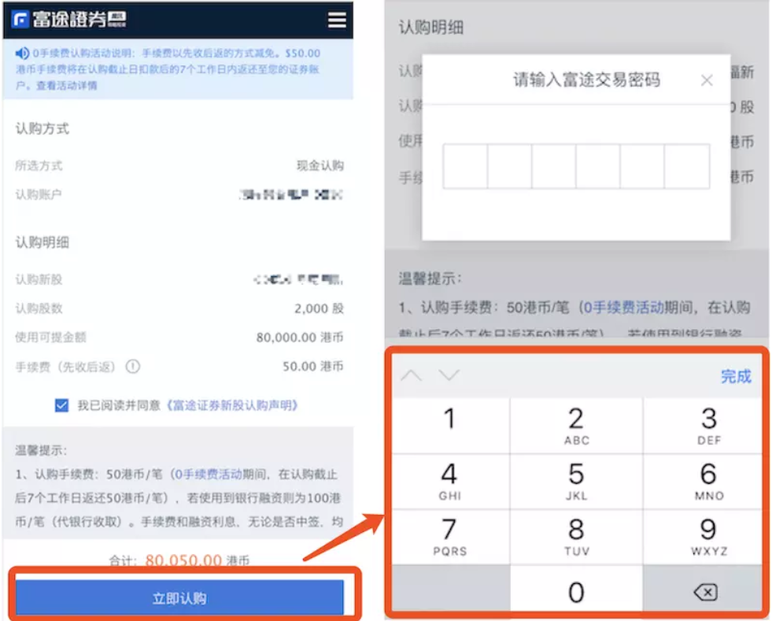

# 移动端软键盘

## 参考文档
1. [移动端 Web 页 input 控制软键盘](https://webfe.kujiale.com/mobile-input-auto-focus/)
2. [【iOS】WKWebView的 keyboardDisplayRequiresUserAction](https://www.jianshu.com/p/60f4f235fc52)

## 基础知识
- iOS UIWebView 中 keyboardDisplayRequiresUserAction 属性。  
  - 默认为YES。如果设置为YES，用户必须明确的点击页面上的元素或者相关联的输入页面来显示键盘；
  - 如果设置为NO，元素的焦点事件导致输入视图的显示和自动关联这个元素。
那么，如果我们加载一个Web页面时，想一开始唤起键盘，除了web端需要设置input 的focus状态外，我们还需要将keyboardDisplayRequiresUserAction设置为false

## 当进入表单页时，让软键盘自动打开
- iOS App 的 WebView 将 keyboardDisplayRequiresUserAction 设置为 NO。
- Android 只能依赖 JSBridge 调用 Android 原生方法唤起键盘。

## 当点击页面中某个元素唤起软键盘
点击元素聚焦指定input，iOS / Android 都支持，但是 iOS 中必须保证 focus 是在用户操作事件的函数执行环境中直接调用（不能使用zepto的tap事件）。
```
<!-- HTML -->
<input id="input" type="text" placeholder="this a input"/> 
<button id="J-focus-btn" onclick="clickFocusBtn()">focus input</button>
// JS
function clickFocusBtn() {
     document.getElementById("input").focus();
}
```
使用了 zepto tap 事件，它在 iOS 上并不能达到预期效果
```js
$('#J-focus-btn').on('tap', function() {
    $('#input').focus();
});
```

## 点击按钮，自动拉起软键盘
需求如下：点击立即认购按钮，弹出密码框，聚焦密码输入框，并拉起软键盘。

- 一般做法：给立即认购添加 click 事件，在事件处理函数中，手动让密码输入框聚焦，即：```$input.focus(); ```，pc端可以正常执行，但是在移动端却不能正常拉起软键盘。
- 原因分析：软键盘只有在用户手动touch输入框foucus的时候才会弹起。  
- 做法：把一个透明的input，覆盖在目标按钮上，当用户点击的时候，其实点击的是input输入框。，拉起软键盘后，可以通过JavaScript执行focus()聚焦到其他输入框，并保证软键盘不会收起，并且可以正常对聚焦的输入框进行输入。

## 表单页多个 input 依次自动聚焦
详细内容，见参考文档1

## 输入框 focus 以后，会出现软键盘遮挡输入框的情况。
可以尝试 input 元素的 scrollIntoView 进行修复。

## 软键盘唤起后，页面的 fixed 元素将失效
软键盘唤起后，页面的 fixed 元素将失效（ios认为用户更希望的是元素随着滚动而移动，也就是变成了 absolute 定位），既然变成了absolute，所以当页面超过一屏且滚动时，失效的 fixed 元素就会跟随滚动了。  
