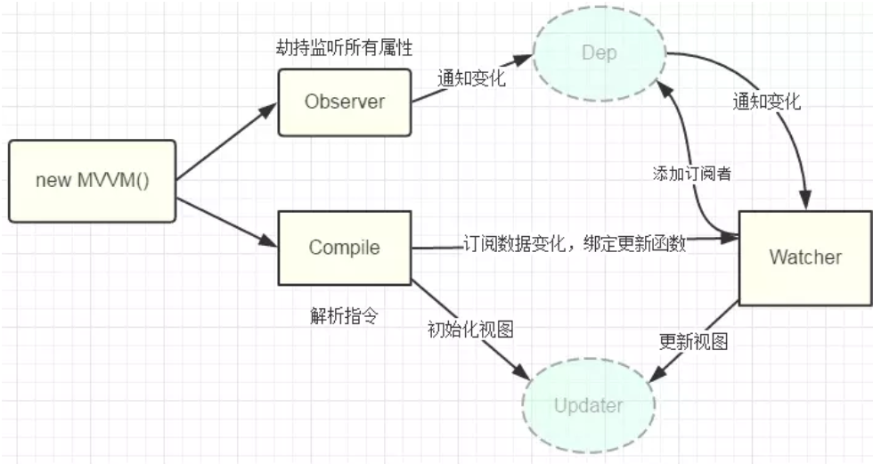

# 有哪些方法可以实现双向数据绑定

- KnockoutJS基于观察者模式的双向绑定
- Ember基于数据模型的双向绑定
- Angular基于脏检查的双向绑定
- Vue基于数据劫持的双向绑定
  - Object.defineProperty
  - ES2015中新增的Proxy
  
  
## 基于数据劫持的双向绑定
### 什么是数据劫持
通常我们利用Object.defineProperty劫持对象的访问器，在属性值发生变化时我们可以获取变化，从而进行下一步操作。

### 基于数据劫持双向绑定的实现思路
1. 利用Proxy或Object.defineProperty生成的Observer针对对象/对象的属性进行"劫持",在属性发生变化后通知订阅者
2. 解析器Compile解析模板中的Directive(指令)，收集指令所依赖的方法和数据,等待数据变化然后进行渲染
3. Watcher属于Observer和Compile桥梁,它将接收到的Observer产生的数据变化,并根据Compile提供的指令进行视图渲染,使得数据变化促使视图变化

## 参考文档
- [面试官: 实现双向绑定Proxy比defineproperty优劣如何?](https://juejin.im/post/5acd0c8a6fb9a028da7cdfaf)
